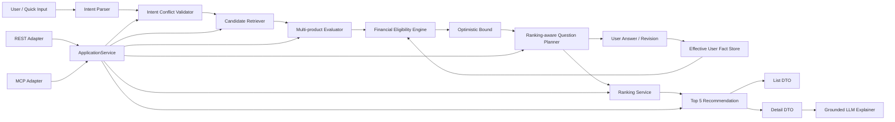

# Financial Eligibility Engine v0.4.6

**Final Conversational Runtime, Working Note & Web Handoff Closure**

문서 안내:

- [로컬 실행 및 테스트 가이드](docs/guides/LOCAL_RUN_AND_TEST_GUIDE.md)
- [Web handoff](docs/handoff/FINANCIAL_ELIGIBILITY_ENGINE_V0_4_6_WEB_HANDOFF.md)
- [전체 문서 인덱스](docs/README.md)

## Web MVP Sprint 1 (v0.4.6 backend 그대로)

`v0.4.6` deterministic backend를 버전 업하지 않고 실제 Web runtime을 추가했다.

핵심 UI:

- Desktop `자연어 Chat + 개인화 추천 영역` split layout
- structured backend state 기반 **현재 AI가 이해한 검색 기준** chips
- active question의 typed quick-answer UI + 자연어 `/messages` entrypoint
- 질문이 남아 있어도 **현재 결과 먼저 보기**
- Top 5/가용 후보 카드: realizable rate, 광고 최고금리, 납입계획, 예상 세후이자, 검증 badge
- 상품 상세 drawer: confirmed/realizable/advertised rate, 예상 이자, 추천 이유, 우대조건 breakdown, 공식 source, grounded AI 설명
- 같은 origin의 FastAPI runtime; 별도 SPA build toolchain 없음

실행:

```bash
pip install -e ".[web,dev]"
# 기본은 MOCK. 실제 자연어 대화 연결은 아래 "OpenAI 연결" 설정 참고.
eligibility-web
# http://localhost:8000
```

기본 `LLM_PROVIDER=MOCK`에서는 초기 검색, deterministic 질문/선택형 답변, Ranking/List/Detail은 동작하지만, mock이 자연어를 이해한 것처럼 가장하지 않기 위해 free-form 후속 `/messages` 해석은 비활성화한다.

### Product Catalog 50 통합

Web runtime의 기본 상품 집합은 더 이상 4개 golden fixture에 한정되지 않는다. `data/product_catalog/products/`의 **50개 strict `ProductDefinition` JSON**을 generic loader로 읽어 동일한 `ApplicationService`의 Candidate Retrieval → Evaluation → Ranking → Top 5 흐름에 투입한다. 기존 4개 Python golden fixture는 회귀테스트용으로 그대로 유지하며, catalog 안의 동일 4개 상품과 semantic equivalence를 검증한다.

```text
data/product_catalog/
├─ products/                 # 50 ProductDefinition JSON
├─ manifests/                # source/resolver/service/validation manifests
├─ catalog_summary.csv
└─ README.md

src/eligibility/catalog/
└─ loader.py                 # generic strict ProductDefinition loader
```

기본 경로는 bundled catalog다. 다른 catalog를 검증할 때만 `ELIGIBILITY_PRODUCT_CATALOG_PATH`로 디렉터리를 덮어쓸 수 있다. source-tree 실행뿐 아니라 일반 package install에서도 catalog가 포함되도록 package-data mirror를 함께 제공한다.

### OpenAI 연결

직접 OpenAI를 사용할 때 `LLM_PROVIDER=OPENAI`는 **Responses API**와 strict Structured Outputs를 사용한다. 현재 기본 모델은 고용량·비용 민감 workload용 `gpt-5.6-luna`다. API key는 코드나 Git에 넣지 말고 환경변수/배포 secret으로 주입한다. `LLM_API_KEY`가 우선이고, 없으면 `OPENAI_API_KEY`를 사용한다.

모델별 요청 차이는 `src/eligibility/llm/model_registry.py`의 profile registry가 관리한다. GPT-5.6 계열(`gpt-5.6-sol`, `gpt-5.6-terra`, `gpt-5.6-luna`)에는 `temperature`를 보내지 않고 `LLM_REASONING_EFFORT`를 `reasoning.effort`로 전달한다. 등록되지 않은 Responses API 모델은 기존 호환 동작을 유지하므로 `temperature`를 사용하고, reasoning은 명시했을 때만 전달한다.

모델 교체는 `.env`의 `LLM_MODEL` 한 줄로 한다. 같은 GPT-5.6 profile 안에서는 어댑터 수정이 필요 없다.

```bash
export LLM_PROVIDER=OPENAI
export LLM_MODEL=gpt-5.6-luna  # 또는 gpt-5.6-terra / gpt-5.6-sol
export OPENAI_API_KEY='...'
export LLM_REASONING_EFFORT=auto  # Luna profile 기본값 low
eligibility-web
```

최종 적용값은 키를 노출하지 않는 진단 명령으로 확인한다.

```bash
eligibility-demo llm-config
eligibility-demo llm-health
```

`LLM_BASE_URL=auto`, `LLM_MODEL=auto`, `LLM_REASONING_EFFORT=auto`는 선택한 provider/profile의 기본값을 사용한다. 새로운 모델군의 parameter compatibility가 다르면 registry에 profile 하나를 추가하고 payload 회귀테스트를 함께 추가한다.

상태 확인:

```text
GET /api/runtime
GET /api/llm/health
```

`OPENAI_COMPATIBLE`은 별도 경로로 유지되며 `/chat/completions`를 제공하는 로컬/외부 서버에 사용한다. OpenAI direct와 compatible server를 같은 adapter로 취급하지 않는다.

Web presentation용 read-only endpoint가 하나 추가되었다.

```text
GET /search-sessions/{id}/state
```

이 endpoint는 `ApplicationService`의 현재 structured mutable state에서 직접 생성되며 Search Working Note를 parse하지 않는다.

---

금융상품 한 개의 가입·우대조건을 판정하는 `FinancialEligibilityEngine.evaluate_product()`를 deterministic primitive로 유지하면서, 여러 상품을 탐색하고 필요한 질문을 선택한 뒤 사용자의 실제 납입계획으로 **Top 5**를 만드는 Application Layer다. v0.4.5는 v0.4.4까지 개별적으로 추가된 Intent/Capability/UserFact/Contribution/ProductChoice/상품 제외/질문 이력을 **현재 Mutable Search State + 자연어 대화 loop**라는 하나의 semantics로 정리한다. 사용자는 backend operation을 알 필요 없이 평범한 자연어로 최신 의도를 말하고, LLM은 의미를 해석해 typed ApplicationService operation을 선택하며, 금융판정·cashflow·금리·이자·Top 5는 deterministic backend가 다시 계산한다.

```text
사용자 자연어 / Quick Input
→ ProductSearchIntent
→ deterministic IntentConflict validation
→ ProductMetadata 기반 cheap hard filter
→ N개 상품 deterministic evaluation
→ optimistic upper bound / Top 5 frontier
→ ranking-aware 금융조건 / RankingInput question
→ UserFact 또는 ProductContributionChoice 갱신
→ 상품별 cashflow 재계산
→ KRW 단위 realizable final ranking
→ Top 5 List DTO
→ Product Detail DTO + grounded LLM explanation
```

## 0. v0.4.6 Final Web Handoff Closure

v0.4.6은 v0.4.5의 Mutable Search State / 자연어 full re-search 구조를 유지하면서 Web UI 직전 마지막 runtime semantics를 닫는다.

- 자연어로 mutable user state를 다시 **미결정**으로 되돌릴 수 있음 (`Capability → UNKNOWN`, user-declared fact/상품별 choice clear, intent preference/constraint remove)
- `"질문은 그만하고 지금 결과 보여줘"`를 turn-local `SHOW_CURRENT_RESULTS`로 처리: active question은 보존하고 현재 deterministic recommendation과 unresolved warning을 반환
- `SearchWorkingNoteStore` 기반 ephemeral continuity note: user utterance를 즉시 기록하고 committed backend state summary를 갱신
- `InMemorySearchWorkingNoteStore` + atomic Markdown `FileSearchWorkingNoteStore` 제공
- Working Note는 Source of Truth가 아니며 stale하면 backend current state로 재생성
- `DELETE /search-sessions/{id}`로 session close + Working Note cleanup
- 외부 LLM prompt context에서 duplicated legacy payload를 제거하고 Working Note + current structured state 중심으로 단순화

Web 구현 기준은 [Web handoff](docs/handoff/FINANCIAL_ELIGIBILITY_ENGINE_V0_4_6_WEB_HANDOFF.md)를 우선 참고한다.


## 1. 핵심 원칙

### LLM과 deterministic code의 경계

LLM은 자연어 인터페이스다.

- 사용자 발화 → 구조화된 Intent draft
- `IntentConflict` → clarification wording
- `MissingFactRequest` → 사용자 질문 wording
- structured recommendation 결과 → 자연어 해설

LLM은 다음을 결정하지 않는다.

- 가입 가능 여부
- `SATISFIED / ACHIEVABLE / UNSATISFIABLE / UNKNOWN`
- 날짜·기간·AND/OR/NOT·aggregation
- 금리·이자·rate cap
- 후보 제거와 Top 5 숫자 순위
- Goal risk와 Alert trigger

### 탐색 상한과 최종 추천의 분리

- **탐색:** favorable `UNKNOWN` branch를 포함한 optimistic upper bound
- **최종 순위:** 사용자 납입계획 기준 deterministic 세후이자와 realizable result

기본 `MAX_ESTIMATED_AFTER_TAX_INTEREST` objective에서는 직접 비교하는 값의 단위를 반드시 통일한다.

```text
realizable_after_tax_interest: KRW ↔ KRW
conditional_upper_after_tax_interest: KRW ↔ KRW
```

Contribution input이 부족해 세후이자를 계산할 수 없으면 `%`를 KRW 대신 sort key에 넣지 않는다. `MissingRankingInput`을 만들고 `ranking_comparability=MISSING_CONTRIBUTION_INPUT`으로 남긴 뒤 Question Planner가 사용자에게 필요한 납입 입력을 묻는다. Optimistic upper도 동일한 원칙을 따른다.

### 답변 수정

사용자가 이전 답을 바꾸면 기존 Fact는 삭제되지 않는다.

```text
기존 답변 → SUPERSEDED
새 답변   → ACTIVE
Audit     → 전체 이력 유지
Core      → ACTIVE Fact만 사용
```

## 2. v0.4.5 Conversational Search State Generalization

### Mutable Search State와 authoritative Fact 분리

사용자가 자연어로 바꿀 수 있는 현재 상태는 다음을 포함한다.

```text
Search Intent
- Hard Constraint / Preference / Numeric Preference / Ranking Objective / 기간

User-declared State
- Capability / FUTURE_INTENT / SELF_REPORTED_FACT

Contribution State
- Global ContributionPlan
- Product-specific ContributionChoice

Search Selection State
- excluded_product_ids
```

반대로 `OBSERVED_FACT / OBSERVED_EVENT / INSTITUTION_VERIFIED / MYDATA_VERIFIED` 등 authoritative evidence는 사용자 발화만으로 수정되지 않는다. Conversation LLM context도 `MUTABLE_SEARCH_STATE`와 `AUTHORITATIVE_FACT_SUMMARY`를 분리해 제공한다.

### 자연어 → typed operation → full re-search

사용자는 `IntentPatch`, `REVISE`, `semantic_key` 같은 내부 표현을 입력하지 않는다.

```text
사용자 자연어
→ ConversationOrchestrator
→ UPDATE_SEARCH_INTENT / SET_PRODUCT_CONTRIBUTION_CHOICE /
   SET_PRODUCT_EXCLUSION / REVISE_USER_DECLARED_FACT /
   SUBMIT_ACTIVE_QUESTION_ANSWER
→ deterministic validation
→ Candidate Retrieval 전체 재실행
→ Candidate Evaluation / Interest / Ranking 재실행
→ 현재 state에서 next question 또는 Top 5
```

기존 typed service/API는 backward compatibility와 Quick UI를 위해 유지한다. `REVISE_PRODUCT_CONTRIBUTION_CHOICE`, `EXCLUDE_PRODUCT` 같은 v0.4.4 operation도 삭제하지 않지만, 새 자연어 orchestration은 가능하면 현재 값을 직접 나타내는 `SET_*` operation을 우선한다.

### 과거 workflow history는 현재 의도를 막지 않는다

- 과거 RankingInput을 `DECLINED`했어도 사용자가 나중에 “카카오는 2천원으로 할게”라고 말하면 현재 choice를 설정한다.
- 과거 상품을 제외했어도 “다시 보여줘”라고 말하면 exclusion을 제거한다.
- 과거 question id가 answered history에 있어도 현재 state에서 같은 정보가 다시 unresolved가 되면 Question Planner가 다시 질문할 수 있다.
- 반대로 현재 active state가 이미 답을 제공하면 과거 question history 때문에 다시 묻지 않는다.

`answered_question_ids`와 declined/exclusion 이력은 Audit/compatibility state로 남길 수 있지만 Question Planner의 business truth는 **현재 CandidateEvaluation에서 실제로 unresolved인가**이다.

### Transactional conversational turn

한 자연어 문장에 여러 변경이 있어도 business state는 원자적으로 처리된다. 예를 들어 월 한도와 capability는 유효하지만 상품별 시작금액 `7천원`이 invalid라면 turn 전체를 rollback한다. 성공한 turn은 최종적으로 전체 candidate retrieval/evaluation/ranking을 다시 실행한다.

### Canonical Web entrypoint

Web은 기존 `POST /search-sessions/{id}/messages` 하나로 자연어 수정 → 재검색 loop를 사용할 수 있다. MCP도 동일 `ApplicationService.handle_user_message()`를 재사용한다.

## 3. v0.4.4 Conversational State Revision Closure

### 자연어 후속 발화 → narrow domain operations

사용자는 JSON patch나 operation 이름을 입력하지 않는다. `ConversationOrchestrator`가 현재 `SearchSession`, active question, active user state, product-specific choice, allowed operation context를 LLM에 전달하고, LLM은 아래의 좁은 ApplicationService operation 중 의미에 맞는 것을 선택한다.

```text
사용자 자연어
→ ConversationOrchestrator (LLM meaning/router only)
→ UPDATE_SEARCH_INTENT / REVISE_PRODUCT_CONTRIBUTION_CHOICE /
   REVISE_USER_ANSWER / REVISE_USER_DECLARED_FACT /
   SUBMIT_ACTIVE_QUESTION_ANSWER / EXCLUDE_PRODUCT
→ deterministic validation / evaluation / ranking
→ next question 또는 refreshed Top 5
```

LLM은 affordability, cashflow, 금리, 세후이자, eligibility, Top 5를 계산하지 않는다. 사용자 발화가 여러 state를 동시에 수정하면 내부 action 여러 개로 해석할 수 있지만, 사용자는 그 구조를 볼 필요가 없다.

### ProductContributionChoice revision / stale choice 재최적화

이미 commit된 상품별 납입 선택도 자연어로 수정할 수 있다. 예를 들어 카카오 시작금액 `10,000 → 3,000` 수정 시 기존 choice는 `SUPERSEDED`, 새 choice만 `ACTIVE`가 되며 history는 Audit 가능하게 유지된다.

Global affordability가 바뀌어 기존 choice가 더 이상 feasible하지 않으면 해당 상품을 곧바로 제거하지 않는다. 현재 조건에서 가능한 replacement options를 다시 계산하고 `CHANGE_PRODUCT_CONTRIBUTION_CHOICE / ADJUST_GLOBAL_AFFORDABILITY / EXCLUDE_PRODUCT` 경로를 제공한다. 과거에 답했던 start-amount 질문도 현재 dependency에서 answer가 무효화되면 새 material question으로 재오픈할 수 있다.

### User-declared state와 authoritative evidence 경계

`Capability / FUTURE_INTENT / SELF_REPORTED_FACT / Preference / ContributionPlan / ProductContributionChoice` 같은 사용자 선언은 후속 자연어로 수정할 수 있다. 이전 user-declared 값은 supersede하고 최신 값 하나만 effective state에 사용한다. 반면 `OBSERVED_FACT / OBSERVED_EVENT / INSTITUTION_VERIFIED / MYDATA_VERIFIED` 등 authoritative evidence는 사용자 대화가 삭제·덮어쓰지 못한다.

### Conversational transaction atomicity

한 자연어 문장이 여러 backend operation으로 해석되어도 business state는 하나의 conversational transaction처럼 다룬다. dependent revision 하나라도 validation에 실패하면 해당 turn의 `SearchSession`, intent, fact store, product choices, active question, evaluation/ranking state를 원상복구한다. Audit에는 rejected attempt와 `CONVERSATION_TURN_ROLLED_BACK`을 남길 수 있다.

### Web / MCP handoff

REST는 `POST /search-sessions/{id}/messages`를 통해 자연어 follow-up을 받고 `ApplicationService.handle_user_message()` 결과인 next question 또는 refreshed recommendations를 반환한다. MCP도 동일 ApplicationService의 conversational operation을 얇게 노출하며 business logic을 복제하지 않는다.

---

## 2. v0.4.3 Contribution Feasibility Closure

### 실제 날짜 cashflow와 전역 affordability

전역 `ContributionPlan.maximum_affordable_periodic_amount`는 사용자가 선언한 frequency에서만 해석한다. 상품별 선택값을 받은 뒤 실제 납입 날짜를 생성하고 그 날짜를 사용자의 전역 affordability cadence로 bucket한다.

```text
Product-specific choice
+ subscription_date
+ ProductMetadata.ContributionPolicy
→ dated cashflow events
→ DAILY / ISO WEEK / calendar MONTH aggregation
→ global affordability validation
```

따라서 `MONTHLY=300,000원`은 weekly 상품의 1회 한도가 아니다. 주간 상품도 실제 calendar month에 5회 출금될 수 있으며 `4주 = 1개월` 근사를 사용하지 않는다.

### 선택지 pruning과 clarification

`MissingRankingInput.allowed_options`는 사용자에게 노출되기 전에 각 option의 실제 schedule을 생성하여 deterministic하게 검증한다. infeasible option은 제거하고 feasible option만 질문한다. 하나만 남아도 자동선택하지 않고 확인하며, 모두 불가능하면 상품을 조용히 제거하지 않고 `ADJUST_GLOBAL_AFFORDABILITY / EXCLUDE_PRODUCT` clarification을 만든다. 가능하면 가장 낮은 option을 유지하기 위한 `minimum_required_affordability`도 함께 제공한다.

### Validation-before-commit

Ranking-input answer는 type/allowed option/product policy/dated cashflow/global affordability를 모두 현재 session state 기준으로 다시 검증한 뒤에만 `ProductContributionChoice`, `answered_question_ids`, active question, ranking state를 변경한다. invalid/infeasible answer는 `CONTRIBUTION_ANSWER_REJECTED` audit만 남길 수 있으며 business state는 그대로 유지되고 같은 질문에 다시 답할 수 있다.

**Historical v0.4.3 limitation:** 이미 정상 commit된 `ProductContributionChoice` revision은 v0.4.3에서 deferred였으며, v0.4.4에서 supersession + revalidation semantics로 구현됐다.

## 2. v0.4.2 Final State Closure

### Global plan과 Product-specific choice 분리

전역 `ContributionPlan`은 사용자의 검색 전체에 적용되는 납입 선호/여력을 유지한다. 특정 상품의 cashflow를 완성하기 위한 답변은 `ProductContributionChoice`로 별도 저장한다.

```text
Global ContributionPlan
- 월 300,000원 희망

KAKAO_26W ProductContributionChoice
- preferred_start_amount = 10,000원

다른 점증식 상품 ProductContributionChoice
- preferred_start_amount = 5,000원
```

상품별 Interest 계산 시에만 `Global ContributionPlan + matching ProductContributionChoice + ContributionPolicy`를 합성한다. 상품 A의 선택은 상품 B나 전역 계획을 변경하지 않는다. 질문 identity도 `product_id + input_type/field`를 포함한다.

### Application state closure

- Intent capability 수정 시 동일 semantic `USER_DECLARED` fact의 이전 active 선언을 supersede
- `INSTITUTION_VERIFIED / MYDATA_VERIFIED` 같은 authoritative evidence는 보호
- `NumericPreference` patch identity를 `(field, direction, currency)`로 관리하여 lower/upper range 동시 보존
- `MAX_REALIZABLE_RATE`에서는 interest 계산만을 위한 contribution 질문을 생략
- 실제 신한·카카오·IBK·하나 regression fixture에 최소 typed `ProductFeature` 연결
- preferential feature와 `required_for_subscription=true` mandatory feature를 명확히 구분
- List/Detail의 숫자·status·추천 reason은 structured DTO가 Source of Truth이며 LLM prose는 보조 설명만 제공

### Web handoff

기존 REST/MCP contract를 유지한다. Ranking-input 질문에는 `product_id`와 `required_field`가 포함되며 답변 후 `SearchSession.product_contribution_choices[]`에 상품별 선택이 기록된다. 전역 `ProductSearchIntent.contribution_plan`은 해당 답변 때문에 변경되지 않는다.

---

## 2A. v0.4.1 Closure Patch

### Application correctness closure

- 예상 세후이자 Ranking에서 KRW/% fallback 제거
- `MissingRankingInput` + `RankingComparability` 도입
- 카카오 26주 시작금액 등 cashflow completion input을 기존 질문 flow로 처리
- 후속 Intent를 category replacement가 아닌 `IntentPatch` upsert/remove semantics로 변경
- Hard Filter를 `ProductMetadata.features` / typed capability semantics 기반으로 변경하고 문자열 keyword 판단 제거
- Question / Result Explanation의 canonical claim을 ACTION, CONDITION, STATUS, PRODUCT_ATTRIBUTE, RECOMMENDATION_REASON까지 확장
- source 밖 비숫자 action/condition 생성 시 deterministic fallback
- Detail Rate Breakdown에서 사용자 의미가 있는 nested OR branch 노출
- Top-K stability를 실제 Question Planner의 material question과 연결
- Recommendation reason을 deterministic structured evidence가 있을 때만 생성
- 카카오 7주/26주 future intent를 achievement target별로 분리하면서 7주 `from_sequence=None` 유지

### Application Schema

- `ProductSearchIntent / IntentPatch`
- `HardConstraint / Preference / Capability / NumericPreference`
- `ContributionPlan / ContributionPlanPatch`
- `MissingRankingInput / RankingComparability`
- `IntentConflict / ClarificationRequest`
- `SearchSession`
- `CandidateEvaluation`
- `QuestionCandidate / PlannedQuestion`
- `RankingResult / ProductRecommendationResult`
- `RecommendationListItem / ProductRecommendationDetail`
- `RateContribution / RateCapAdjustment`

### Candidate Retrieval

초기 검색은 확실한 hard failure만 제거한다. 상품 feature 판정은 typed `ProductFeature`와 mandatory capability metadata를 사용하며 Rule label의 `CARD`, `카드`, `NEW_CARD` 같은 문자열을 authoritative filter 근거로 사용하지 않는다.

- 판매 종료·중지
- product type 확정 불일치
- hard term·납입·채널 조건 위반
- 확정적인 가입대상 불일치

다음은 초기 제거 사유가 아니다.

- 가입 가능 여부 `UNKNOWN`
- 데이터 부재
- 특정 우대조건 `UNSATISFIABLE`
- Capability `CANNOT`
- Preference 불일치

### Ranking-Aware Question Planner

Planner는 두 종류의 unresolved input을 하나의 flow에서 다룬다.

- 금융조건 질문: 급여계좌 변경, 서비스 가입 의향 등 `MissingFactRequest`
- Ranking 계산 입력 질문: 납입금액, 시작금액, 기간 등 `MissingRankingInput`

고정 질문 예산을 두지 않는다. 대신 다음 질문을 제거한다.

- 탈락 후보에만 관련된 질문
- optimistic upper로도 Top 5 진입이 불가능한 후보 질문
- 이미 만족된 OR branch의 대체 질문
- 답을 알아도 eligibility·Top 5·상위권 순위·주요 설명이 바뀌지 않는 질문
- 사용자에게 물을 수 없는 기관 authoritative Fact

하나의 Fact가 여러 상품에 영향을 주면 하나의 질문으로 묶어 영향 상품을 함께 재평가한다.

### Final Ranking

기본 lexicographic ordering:

1. **비교 가능한 후보끼리** 실제 납입계획 기준 예상 세후이자(KRW)
2. realizable rate는 같은 KRW metric 안에서 tie-breaker
3. Preference 적합도
4. Action burden 낮은 순
5. material UNKNOWN 적은 순
6. deterministic product-id tie-breaker

사용자가 “금리가 가장 높은 상품”을 명시하면 `MAX_REALIZABLE_RATE`를 사용한다.

### List / Detail Contract

List에는 최소 다음을 제공한다.

- 순위, 기관, 상품명, 상품유형
- 사용자 기준 realizable rate, 광고 최고금리
- 기간, 납입방식, 최대 납입, 사용자 계획
- 예상 총 원금, 예상 세후이자
- eligibility / verification badge
- material unknown 수
- `ranking_comparability`, missing ranking input 수

Detail에는 다음을 추가한다.

- confirmed / realizable / advertised rate
- 예상 세전·세후이자
- 조건별 nominal `+x%p`
- 상태, verification, evidence, action, reason code, provenance
- aggregate rate cap adjustment
- 의미 있는 OR branch의 recursive `children[]` breakdown
- ranking comparability / unresolved contribution input
- structured personalized recommendation reason와 evidence
- canonical claim 검증을 통과한 LLM explanation

## 3. 아키텍처



`REST`와 `MCP`는 같은 `ApplicationService`를 호출하며 금융판정·Ranking을 복제하지 않는다.

## 4. 패키지 구조

```text
src/eligibility/
├── application.py             # Question grounding, answer mapping/revision
├── application_service.py     # transport-independent orchestration
├── conversation.py            # LLM natural-language follow-up router
├── adapters/
│   ├── rest.py                # framework-neutral REST contract
│   └── mcp.py                 # thin MCP-style tool adapter
├── search/
│   ├── intent.py              # parsing, patch/merge, conflict validation
│   ├── retrieval.py           # typed cheap hard filtering
│   ├── contribution.py        # user plan → product cashflow projection
│   ├── evaluation.py          # N × deterministic core evaluation
│   ├── questions.py           # financial + RankingInput Top-K planning
│   ├── ranking.py             # same-unit realizable ranking and stability
│   └── recommendation.py      # List/Detail/grounded explanation
├── llm/grounding.py           # typed canonical claims
├── engine/                    # existing deterministic core
├── schema/search.py           # v0.4.5 Application/Web state DTOs
├── schema/conversation.py     # internal conversational operation contract
└── audit/                     # append-only trace
```

## 5. 설치와 테스트

Python 3.11 이상이 필요하다.

```bash
cd financial-eligibility-engine-v0.4.6
python -m venv .venv
source .venv/bin/activate
pip install -e ".[dev]"
pytest
```

의존성이 이미 설치된 환경:

```bash
PYTHONPATH=src pytest
```

검증 명령:

```bash
PYTHONPATH=src python -m compileall -q src tests scripts
python -m pip wheel . --no-deps --no-build-isolation -w dist
PYTHONPATH=src python scripts/export_schemas.py
PYTHONPATH=src python scripts/run_v04_adversarial.py
PYTHONPATH=src python scripts/run_v041_adversarial.py
PYTHONPATH=src python scripts/run_v042_adversarial.py
PYTHONPATH=src:. python scripts/run_v043_adversarial.py
PYTHONPATH=src:. python scripts/run_v044_adversarial.py
PYTHONPATH=src:. python scripts/run_v045_adversarial.py
```

현재 v0.4.5 suite는 기존 v0.3.2/v0.4/v0.4.1/v0.4.2/v0.4.3/v0.4.4 regression과 v0.4.5 conversational-state-generalization regression을 함께 실행한다. 상세 결과는 `reports/`와 [v0.4.5 구현 보고서](docs/reports/releases/V0_4_5_IMPLEMENTATION_REPORT.md)에 기록한다.

## 6. ApplicationService 예시

```python
from datetime import date

from eligibility import ApplicationService
from eligibility.fixtures.hana_run import hana_run_product
from eligibility.fixtures.ibk_parent_benefit import ibk_parent_benefit_product
from eligibility.fixtures.kakao_26_week import kakao_26_week_product
from eligibility.fixtures.shinhan_youth_first import shinhan_youth_first_product

service = ApplicationService(
    [
        shinhan_youth_first_product(),
        kakao_26_week_product(),
        ibk_parent_benefit_product(),
        hana_run_product(),
    ]
)

session = service.create_search_session(
    user_id="USER-001",
    utterance="1년 정도 월 30만원을 넣을 적금 중 나에게 좋은 상품을 찾아줘.",
    as_of=date(2026, 8, 20),
    subscription_date=date(2026, 8, 20),
)

question = service.get_next_question(session.search_session_id)
if question:
    service.submit_user_answer(
        session.search_session_id,
        question_id=question.question_id,
        answer=True,
    )

result = service.get_top_recommendations(session.search_session_id)
detail = service.get_product_recommendation_detail(
    session.search_session_id,
    result.top_products[0].product_id,
)
```

## 7. REST contract

Framework를 강제하지 않는 thin adapter를 제공한다.

```text
POST  /search-sessions
GET   /search-sessions/{id}
GET   /search-sessions/{id}/clarifications/current
POST  /search-sessions/{id}/clarifications
GET   /search-sessions/{id}/questions/next
POST  /search-sessions/{id}/answers
PATCH /search-sessions/{id}/answers/{request_reference}
PATCH /search-sessions/{id}/intent
GET   /search-sessions/{id}/recommendations
GET   /search-sessions/{id}/recommendations/{product_id}
GET   /search-sessions/{id}/trace
```

`POST /search-sessions`는 `natural_language_query`와 structured `quick_input`을 함께 받을 수 있다. 같은 key가 충돌하면 Quick Input의 직접 structured value가 LLM/자연어 추론보다 우선한다. 동일 Quick Input field에 상반된 값을 동시에 넣은 malformed structured payload는 validation error/400으로 처리한다. 서로 다른 valid input source 간 의미 충돌만 `IntentConflict` clarification으로 보낸다. `CLARIFICATION_REQUIRED` 상태에서는 current clarification endpoint에서 실제 질문과 허용 resolution을 조회할 수 있다. Product-specific contribution 질문도 기존 `questions/next` → `answers` endpoint로 처리하며, 응답 session의 `product_contribution_choices`에 기록된다.

실제 FastAPI/Flask 서버와 Web UI는 이번 Sprint 범위가 아니다.

예시 요청:

```json
{
  "user_id": "USER-001",
  "natural_language_query": "1년 정도 월 30만원을 넣을 적금 찾아줘",
  "quick_input": {
    "capabilities": [
      {"capability_id": "NEW_CARD_ISSUANCE", "state": "CANNOT"}
    ]
  },
  "as_of": "2026-08-20",
  "subscription_date": "2026-08-20"
}
```

## 8. MCP-style tools

```text
search_products
get_search_status
get_current_clarification
get_next_question
submit_user_fact
revise_user_fact
update_search_intent
get_top_recommendations
get_product_detail
get_evaluation_trace
```

SDK dependency 없이 contract와 동일 서비스 재사용을 검증한다.

## 9. Audit

검색부터 설명까지 하나의 chain으로 추적한다.

```text
SEARCH_SESSION_CREATED
SEARCH_INTENT_PARSED / UPDATED
INTENT_CONFLICT_DETECTED
CLARIFICATION_REQUESTED / RESOLVED
CANDIDATE_FILTERED / RETAINED / EVALUATED
OPTIMISTIC_BOUND_CALCULATED
QUESTION_CANDIDATE_SCORED / QUESTION_SELECTED
USER_ANSWER_SUPERSEDED
USER_DECLARED_FACT_SUPERSEDED_BY_INTENT_UPDATE
PRODUCT_CONTRIBUTION_INPUT_REQUESTED / RECORDED
RANKING_CALCULATED
TOP_K_STABILITY_CHECKED
RECOMMENDATION_CREATED
PRODUCT_DETAIL_OPENED
EXPLANATION_GENERATED
```

검색 식별자:

```text
request_id
search_session_id
intent_version
ranking_run_id
evaluation_id
trace_id
question_id
recommendation_id
```

## 10. 보존된 핵심 회귀

카카오뱅크 26주적금의 7주 우대는 가입 첫 주부터만이 아니라 가입기간 중 **어느 시점에서든 7주 연속 자동이체 성공**이면 성립한다.

```text
1 SUCCESS
2 FAILED
3 SUCCESS
4 SUCCESS
5 SUCCESS
6 SUCCESS
7 SUCCESS
8 SUCCESS
9 SUCCESS

3~9 = 7연속 → +1.0%p
```

수동 빈자리 채우기는 자동이체 성공을 복구하지 않는다.

## 11. Known limitations

- **Deferred:** 이미 정상 commit된 상품별 납입 선택(`ProductContributionChoice`)을 이후 다른 값으로 수정하는 revision UX는 v0.4.3 범위 밖이다. validation 실패 후 같은 질문에 다시 답하는 것은 지원한다.
- 실제 MyData·은행 API·상품 자동수집은 연결하지 않는다.
- 실행 catalog는 50개 ProductDefinition이며, 기존 공식 Python golden fixture 4개는 regression oracle로 유지한다. 50개 중 resolver/service dependency가 남은 상품은 UNKNOWN semantics를 보존한다.
- 신한 급여우대의 모든 공식 ActionPath는 아직 완전 구현하지 않는다. 미평가 대체경로는 보수적으로 `UNKNOWN` 처리한다.
- REST adapter는 framework-neutral contract이며 production HTTP server가 아니다.
- MCP adapter는 SDK 없는 thin contract다.
- 완전한 Net Benefit, 행동 성공확률, 질문 피로 최적화는 후속 범위다.
- 예상이자는 상품 ContributionPolicy를 반영한 deterministic approximation이며 실제 은행의 일수·절사 규칙과 차이가 날 수 있다.
- **Accepted AI Risk:** 최초 사용자 자연어를 LLM이 Structured Intent로 변환할 때 의미를 잘못 해석할 가능성은 MVP에서 완전히 제거하지 않는다. schema/enum validation, deterministic IntentConflict validation, 원본 utterance↔parsed intent Audit, `Quick Input > LLM inferred value` 우선순위를 유지하며, 이후 Eligibility / Rate / Interest / Ranking은 deterministic code가 수행한다.
- **Accepted AI Risk:** Result Explanation은 structured reason codes / claims / rule status를 context로 받지만 자연스러운 자유 prose를 허용한다. 설명 문장은 금융판정 Source of Truth가 아니며, Web UI의 금리·이자·상태·추천 reason은 항상 structured backend DTO를 직접 렌더링한다.
