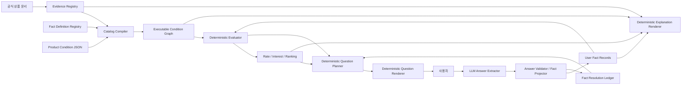

# ddakrate 상품 추천 대화 일반화 설계

- 작성일: 2026-08-22
- 상태: 구현 전 설계안
- 대상 기준선: 현재 `src/eligibility` 런타임과 50개 상품 카탈로그
- 범위: 적금·예금·CMA·파킹통장의 조건 확인, 질문, 답변 반영, 추천 종료, 근거 설명

> **구현 계약 갱신:** 이 문서의 일반화 원칙을 실제 4,292개 카탈로그에 적용하기 위한 최종 범위와 상태 전이는 [`guides/TOP3_CONDITION_QUESTION_IMPLEMENTATION_DESIGN.md`](guides/TOP3_CONDITION_QUESTION_IMPLEMENTATION_DESIGN.md)에 정리되어 있다. 특히 표시 Top 3와 질문 frontier 분리, 사용자 변수 기반 질문, 세션 범위 상태, 수수료 등 정보성 조건 제외, 모호한 답변을 재질문하지 않고 `확인 전`으로 남기는 정책은 후속 문서를 우선한다.

## 0. 결론

상품별 대화 코드를 없애려면 `fact_type` 문자열과 질문 문장을 상품 JSON에 더 많이 넣는 것만으로는 부족하다. 다음 네 층을 분리해야 한다.

1. **Fact Definition/Fact Record**: 사용자에 관해 무엇을 알고 있는지 표현한다.
2. **Condition Graph**: 각 상품이 그 Fact를 어떤 범위·연산자·임계값으로 사용하는지 표현한다.
3. **Evidence Registry**: 상품 조건 자체의 공식 근거와 사용자 사실의 관측 근거를 분리해 저장한다.
4. **Conversation Runtime**: unresolved condition을 공통 `FactKey` 또는 명시적인 bundle contract로 묶고, deterministic하게 질문을 고른다.

LLM은 최초 의도와 사용자 답변을 제한된 structured output으로 변환한다. 다음 질문, 상품 판정, 금리, 이자, Top K, 종료 여부, 설명에 사용할 claim은 모두 backend가 결정한다.

최종 추천의 핵심 불변조건은 다음과 같다.

```text
CONFIRMED Top K
= Top K 순위가 deterministic bound상 안정적
AND 각 Top K 상품의 REQUIRED_FOR_RECOMMENDATION 조건이 모두 accepted evidence로 닫힘
AND 금액·기간·현금흐름 입력이 모두 비교 가능
AND NOT_ASKED인 material condition이 순위 또는 Top K 진입 가능성을 남기지 않음
```

확인할 수 없는 필수 가입조건이 있는 상품은 confirmed Top K에 넣지 않는다. K개를 채울 수 없으면 확인된 상품 수만 반환하고 나머지는 별도의 provisional 후보로 표시한다.

---

## 1. 현재 코드와 상품 데이터에서 확인한 사실

### 1.1 이미 잘 분리된 부분

- `ProductDefinition`은 eligibility, preferential rules, global guards를 Rule AST로 저장한다 (`schema/product.py:158`).
- `FactComparisonRule`, 집계, 존재/부재, 시간창과 future achievement가 deterministic evaluator에서 실행된다 (`schema/rule.py:289` 등).
- `UserFact`는 semantic type, source type, provenance와 append-only revision을 지원한다 (`schema/user_fact.py:31`, `:247`).
- LLM은 현재도 intent와 후속 발화를 structured output으로 변환하고, 금융판정은 backend가 수행한다 (`conversation.py:25`).
- 질문 후보 점수와 선택은 `RankingAwareQuestionPlanner`가 수행한다 (`search/questions.py:47`, `:311`).
- `PreSearchAnswerStatus`에는 `NOT_ASKED`와 `ACKNOWLEDGED_UNKNOWN`이 이미 분리돼 있다.

따라서 기존 Rule AST와 evaluation trace는 버리지 않고 확장하는 것이 맞다.

### 1.2 일반화를 막는 현재 결합

| 현재 구조 | 문제 |
|---|---|
| 질문 그룹 키가 `(fact_type, expected_semantic_type)`뿐임 (`search/questions.py:165-198`) | subject, 기관, 시간범위, value schema, operator가 다른 요청도 같은 질문으로 충돌할 수 있다. |
| 그룹의 대표 `MissingFactRequest` 하나만 답변 저장에 사용됨 | 같은 질문에 묶인 모든 request/condition의 resolution lifecycle을 정확히 닫을 수 없다. |
| 질문 ID도 fact type과 semantic type으로만 생성됨 | 서로 다른 scope의 질문이 같은 ID를 가질 수 있다. |
| `application_service.py:2153-2414`에 신한카드, 쿠폰, 카카오 직접입금, Touch UP, 토스 자동이체, 마이키즈, SuperSOL 설명 분기가 있음 | 상품·팩트가 늘 때마다 runtime 코드를 수정해야 한다. |
| `application.py:61-121`도 알려진 fact family를 별도로 우회·렌더링함 | 질문 생성의 두 번째 하드코딩 지점이다. |
| unknown skip은 `skipped_question_ids` set으로만 저장됨 (`application_service.py:1757-1774`) | `NOT_ASKED`, fact-level unknown, condition별 허용 정책과 별개인 질문 이력으로 남는다. |
| 추천 확정 시 대표 request ID만 acknowledged set에 반영 (`application_service.py:1834-1869`) | 하나의 공통 질문이 여러 request를 닫았다는 사실을 완전하게 나타내지 못한다. |
| `complete=True`는 confirmation 여부와 별개로 session을 `COMPLETED`로 만들 수 있음 (`application_service.py:1881-1888`) | UI workflow 완료와 금융적으로 확정된 Top K가 혼동된다. |
| SourceReference는 문서·페이지·섹션·URL을 갖지만 많은 상품의 `source_text`는 null | deterministic 설명에 필요한 공식 claim이 source locator와 별도로 정규화돼 있지 않다. |

### 1.3 현재 카탈로그의 실제 범위와 품질

`src/eligibility/catalog/data/product_catalog/products` 50개를 직접 집계한 결과는 다음과 같다.

- 상품 유형: 50개 전부 `INSTALLMENT_SAVINGS`
- Rule node: `FACT_COMPARE` 189개, `COUNT_DISTINCT_PERIODS` 66개, `AND` 8개, `OR` 2개 등
- `MissingFactSpec`: 총 203개
  - `QUERY_INSTITUTION` 123개
  - `ASK_USER` 78개
  - `QUERY_MYDATA` 2개
- ASK_USER 78개 중 future intent 71개, self-reported fact 7개
- `WILL_KAKAO_M1_MANUAL_DEPOSIT_DAY`만 37개, `WILL_KN_TOUCH_DEPOSIT_DAY`만 25개로 임계값별 boolean 질문이 반복된다.
- validation manifest의 252개 decision unit 중 DSL supported는 52개이며, resolver/service/user fact 의존이 200개다.
- 카탈로그 품질등급은 50개 모두 B, 상태는 `READY_WITH_LIMITATIONS`다.
- 46개 상품이 coarse `ELIGIBILITY_PROFILE_RESOLVER`에 의존한다.

즉, 200개 상품 확장 전에 질문 일반화뿐 아니라 coarse product-specific boolean을 공통 leaf fact와 condition으로 내려야 한다.

---

## 2. 목표 아키텍처



설계상 중요한 구분은 다음과 같다.

- **상품 조건의 진실**: 공식 Evidence에 연결된 Condition Graph
- **사용자에 대한 진실 또는 선언**: provenance를 가진 Fact Record
- **아직 물었는지 여부**: Fact Resolution Ledger
- **문장 표현**: 위 세 구조에서 생성된 claim/template 결과

질문 문자열이나 설명 문자열이 금융 규칙의 원본이 되어서는 안 된다.

### 2.1 한 대화 turn의 처리 흐름

```text
1. Product Condition Graph + User Fact Records를 deterministic 평가
2. 모든 상품의 lower/upper 금리·이자와 rank interval 계산
3. current Top K와 optimistic contender frontier 산출
4. frontier의 unresolved condition을 FactKey/Answer Contract로 묶음
5. deterministic priority로 QuestionGroup 하나 선택
6. approved template와 official claim으로 질문·설명 렌더링
7. LLM이 사용자 자연어를 발행된 slot의 structured answer로만 변환
8. backend가 slot/type/unit/range를 검증하고 FactRecord/ResolutionState를 append
9. dependency index로 영향받는 모든 상품을 재평가·재정렬
10. confirmed Top K predicate를 검사하고, 거짓이면 3번부터 반복
```

이 흐름에서 LLM 전후의 모든 상태 변경은 question ID와 slot ID에 고정된다. LLM 응답만으로 새로운 fact나 condition이 생기지 않는다.

---

## 3. 공통 Fact 스키마

### 3.1 FactDefinition

`FactDefinition`은 상품과 무관한 재사용 가능한 의미 사전이다. 기관·상품·기간은 fact 이름에 붙이지 않고 parameter로 둔다.

```json
{
  "fact_definition_id": "CARD_HELD",
  "schema_version": "1.0",
  "fact_category": "CURRENT_STATE",
  "allowed_record_semantic_types": [
    "OBSERVED_FACT",
    "DERIVED_FACT",
    "SELF_REPORTED_FACT"
  ],
  "value_schema": {"type": "boolean"},
  "parameter_schema": {
    "type": "object",
    "required": ["issuer_id", "ownership", "card_kinds"],
    "properties": {
      "issuer_id": {"type": "string"},
      "ownership": {"enum": ["SELF", "RELATED_PERSON"]},
      "card_kinds": {
        "type": "array",
        "items": {"enum": ["CREDIT", "DEBIT"]},
        "minItems": 1
      }
    },
    "additionalProperties": false
  },
  "temporal_model": "POINT_IN_TIME",
  "subject_model": "PERSON",
  "resolver_routes": ["CARD_HOLDING_RESOLVER", "ASK_USER"],
  "default_acceptance_policy": {
    "authoritative": ["INSTITUTION_VERIFIED", "MYDATA_VERIFIED"],
    "self_reported_allowed": true
  },
  "conversation_contract": {
    "question_family_id": "CURRENT_CARD_HOLDING",
    "answer_schema_id": "BOOLEAN_V1",
    "answer_semantic_type": "SELF_REPORTED_FACT",
    "question_template": "{issuer_label}에서 발급한 본인 명의 {card_kinds_label}를 현재 보유하고 있나요?",
    "short_label_template": "{issuer_label} 카드 보유",
    "unknown_allowed": true
  }
}
```

`SHINHAN_CARD_HELD`처럼 기관명이 박힌 fact type은 다음처럼 canonical key로 변환한다.

```json
{
  "fact_definition_id": "CARD_HELD",
  "subject": {"person_ref": "CURRENT_USER"},
  "parameters": {
    "issuer_id": "SHINHAN_CARD",
    "ownership": "SELF",
    "card_kinds": ["CREDIT", "DEBIT"]
  },
  "effective_at": {"context": "AS_OF"}
}
```

이 정규화 객체의 canonical hash가 `FactKey`다. 같은 FactKey를 참조하는 모든 상품 condition은 한 답을 공유한다.

### 3.2 FactRecord

`FactRecord`는 실제 관측값 또는 사용자 선언이다. 현재 `UserFact`의 append-only 구조를 유지하면서 `fact_key`를 추가하는 방향이 적합하다.

```json
{
  "fact_record_id": "FACT-01J...",
  "fact_key": "FK-9c8...",
  "fact_definition_id": "CARD_HELD",
  "subject": {"person_ref": "USER-001"},
  "parameters": {
    "issuer_id": "SHINHAN_CARD",
    "ownership": "SELF",
    "card_kinds": ["CREDIT", "DEBIT"]
  },
  "value": true,
  "semantic_type": "SELF_REPORTED_FACT",
  "source_type": "USER_DECLARED",
  "valid_from": "2026-08-22",
  "valid_to": null,
  "evidence_refs": ["EVID-USER-ANSWER-01J..."],
  "record_status": "ACTIVE",
  "version": 1
}
```

### 3.3 FactResolutionState

`NOT_ASKED`와 `ACKNOWLEDGED_UNKNOWN`은 fact value가 아니므로 `FactRecord(value=false/null)`로 저장하면 안 된다. 별도 resolution ledger에 저장한다.

```json
{
  "resolution_id": "FRS-01J...",
  "search_session_id": "SEARCH-...",
  "fact_key": "FK-9c8...",
  "status": "ACKNOWLEDGED_UNKNOWN",
  "question_id": "Q-...",
  "resolved_fact_record_id": null,
  "reason": "USER_CANNOT_CONFIRM",
  "updated_at": "2026-08-22T10:31:00+09:00",
  "version": 1
}
```

허용 상태는 다음과 같다.

| 상태 | 의미 | FactRecord 생성 |
|---|---|---:|
| `NOT_ASKED` | 아직 질문·조회하지 않음 | 아니요 |
| `ASKED` | 질문했으나 유효한 답이 없음 | 아니요 |
| `RESOLVED` | 유효한 FactRecord가 있음 | 예 |
| `ACKNOWLEDGED_UNKNOWN` | 사용자가 모름을 명시함 | 아니요 |
| `NOT_APPLICABLE` | 질문 contract상 적용되지 않음이 검증됨 | 필요 시 별도 구조화 record |
| `UNAVAILABLE` | 기관/API/resolver가 현재 사용 불가 | 아니요 |
| `CONFLICT` | 상충하는 accepted evidence가 있음 | 복수 record 유지 |

`ACKNOWLEDGED_UNKNOWN`은 질문을 반복하지 않게 할 수 있지만, condition을 참이나 거짓으로 만들지 않는다.

---

## 4. 공통 Condition 스키마

### 4.1 ConditionInstance

기존 Rule AST primitive는 유지하되 leaf node에 명시적인 FactQuery, confirmation policy와 공식 claim을 연결한다.

```json
{
  "condition_id": "SHINHAN_YOUTH_FIRST:CARD_HELD:20260722",
  "product_id": "SHINHAN_YOUTH_FIRST_SAVINGS_20260722",
  "purpose": "PREFERENTIAL_RATE",
  "evaluation_phase": "PRE_SUBSCRIPTION",
  "fact_query": {
    "fact_definition_id": "CARD_HELD",
    "subject": {"person_ref": "CURRENT_USER"},
    "parameters": {
      "issuer_id": "SHINHAN_CARD",
      "ownership": "SELF",
      "card_kinds": ["CREDIT", "DEBIT"]
    },
    "effective_at": {"context": "AS_OF"}
  },
  "predicate": {"operator": "EQ", "expected": true},
  "outcome": {
    "on_true": "SATISFIED",
    "on_false": "UNSATISFIABLE",
    "on_missing": "UNKNOWN"
  },
  "confirmation_policy": {
    "level": "OPTIONAL_BENEFIT",
    "accepted_evidence_levels": [
      "INSTITUTION_VERIFIED",
      "MYDATA_VERIFIED",
      "SELF_REPORTED"
    ],
    "acknowledged_unknown_effect": "WAIVE_BENEFIT_FOR_SESSION"
  },
  "official_claim_refs": ["CLAIM-SHYF-CARD-001"],
  "display": {
    "label": "본인 명의 신한카드 보유",
    "group_id": "SHYF_CARD_PREFERENCE_PATH",
    "order": 1
  }
}
```

`confirmation_policy.level`은 다음 세 값으로 제한한다.

- `REQUIRED_FOR_RECOMMENDATION`: 가입자격, 법적 대상, 현재 판매 여부, 금액/기간 허용, 순위 계산 필수값. accepted evidence가 없으면 confirmed Top K에 들어갈 수 없다.
- `MATERIAL_FOR_RANKING`: 가입은 가능하지만 답에 따라 Top K 구성·순서가 바뀐다. 질문하거나 사용자가 보수적 제외를 승인해야 한다.
- `OPTIONAL_BENEFIT`: 모르면 혜택을 0으로 두고 상품 기본조건으로 비교할 수 있다.

정책은 rule purpose만 보고 runtime에서 추측하지 않는다. 카탈로그 compiler가 기본값을 부여하고 human review가 확정한다.

### 4.2 Logical condition과 benefit

상품별 설명 가능한 구조는 condition leaf, logical group, benefit을 분리한다.

```json
{
  "condition_group_id": "SHYF_CARD_PREFERENCE_PATH",
  "type": "AND",
  "label": "신한카드 결제 우대",
  "children": [
    "SHINHAN_YOUTH_FIRST:CARD_HELD:20260722",
    "SHINHAN_YOUTH_FIRST:SETTLEMENT_ACCOUNT:20260722",
    "SHINHAN_YOUTH_FIRST:CARD_PAYMENT_MONTHS:20260722"
  ],
  "benefit": {
    "benefit_id": "SHYF_RATE_CARD",
    "type": "INTEREST_RATE",
    "value": "0.5",
    "unit": "PERCENTAGE_POINT",
    "cap_group_id": "SHYF_PREFERENTIAL_RATE_CAP"
  },
  "official_claim_refs": ["CLAIM-SHYF-CARD-ROOT-001"]
}
```

현재 신한카드 보유 질문의 긴 하드코딩 설명은 renderer가 위 graph를 순회해 다음 세 atom을 조합하면 된다.

1. 본인 명의 신한 신용/체크카드 보유
2. 본인 명의 신한은행 입출금통장을 결제계좌로 사용
3. 공식 기간 안에 1원 이상 결제한 달 6개월 이상

질문은 첫 atom을 묻고, “왜 묻나요?”는 parent group 전체를 설명한다. 어떤 문장도 `application_service.py`에 존재하지 않는다.

### 4.3 반복 임계값은 boolean fact 여러 개가 아니라 metric 하나로 저장

현재 한달적금의 37개 `WILL_KAKAO_M1_MANUAL_DEPOSIT_DAY` 조건은 하나의 사용자 metric으로 정규화한다.

```json
{
  "fact_definition_id": "PLANNED_MANUAL_DEPOSIT_DISTINCT_DAYS",
  "parameters": {
    "action_context_id": "KAKAOBANK_ONE_MONTH_MANUAL_DEPOSIT",
    "term": {"value": 31, "unit": "DAY"}
  },
  "value_schema": {"type": "integer", "minimum": 0, "maximum": 31}
}
```

각 reward condition은 동일 FactKey에 대해 `GTE 1`, `GTE 2`, ..., `GTE 31`을 평가한다. 사용자가 “30일까지 가능”이라고 한 번 답하면 31개 condition이 동시에 deterministic하게 평가된다. Touch UP 25단계도 같은 패턴으로 전환한다.

---

## 5. Evidence 스키마와 공식 근거 저장

### 5.1 두 종류의 Evidence를 분리

1. **Rule Evidence**: “이 상품 조건이 공식적으로 무엇인가”를 증명한다.
2. **Fact Evidence**: “이 사용자가 그 조건에 해당하는가”를 증명한다.

공식 상품설명서는 Rule Evidence이지 사용자 Fact Evidence가 아니다. 사용자 답변은 Fact Evidence이지 공식 상품조건의 출처가 아니다.

### 5.2 EvidenceDocument와 EvidenceClaim

```json
{
  "evidence_document_id": "DOC-SHINHAN-YOUTH-FIRST-20260722",
  "authority": "SHINHAN_BANK",
  "document_type": "PRODUCT_DESCRIPTION",
  "title": "신한은행 청년 처음적금 상품설명서",
  "source_url": "https://img.shinhan.com/...PDF",
  "version_date": "2026-07-22",
  "effective_from": "2026-07-22",
  "effective_to": null,
  "retrieved_at": "2026-08-20T22:15:00+09:00",
  "content_hash": "sha256:...",
  "review_status": "HUMAN_VERIFIED"
}
```

```json
{
  "claim_id": "CLAIM-SHYF-CARD-ROOT-001",
  "evidence_document_id": "DOC-SHINHAN-YOUTH-FIRST-20260722",
  "locator": {"page": 2, "section": "[2] 신한카드 결제 우대"},
  "claim_type": "CONDITION_DEFINITION",
  "structured_claim": {
    "card_issuer": "SHINHAN_CARD",
    "ownership": "SELF",
    "settlement_institution": "SHINHAN_BANK",
    "minimum_payment_amount": {"value": 1, "currency": "KRW"},
    "minimum_qualifying_months": 6,
    "window_start": "SUBSCRIPTION_MONTH_START",
    "window_end": "MATURITY_MINUS_2_MONTH_END"
  },
  "source_excerpt": null,
  "review_status": "HUMAN_VERIFIED"
}
```

`source_excerpt`가 없어도 human-reviewed structured claim과 정확한 locator, version, content hash가 있어야 한다. 반대로 URL만 있고 claim projection이 없으면 runtime 설명용으로 활성화하지 않는다.

### 5.3 활성화 품질 게이트

상품 condition은 다음을 모두 통과해야 online catalog에 들어간다.

- 모든 eligibility/reward/rate/pricing leaf가 최소 하나의 official claim을 참조한다.
- claim의 document version/effective period가 상품 version과 호환된다.
- rule의 숫자·단위·기간·기관 parameter가 structured claim과 일치한다.
- coarse `ELIGIBLE_<PRODUCT>` fact에는 세부 정의 claim과 resolver contract가 없으면 `REQUIRED_FOR_RECOMMENDATION`을 닫을 수 없다고 표시한다.
- pricing evidence가 `as_of`에 유효하지 않으면 금리 비교에서 제외하거나 refresh-required로 둔다.

---

## 6. 여러 상품 조건을 하나의 질문으로 묶는 방법

### 6.1 기본 원칙: 문자열이 아니라 Answer Contract로 묶는다

안전한 공통 질문의 최소 단위는 `QuestionGroup`이다.

```json
{
  "question_group_id": "QG-...",
  "question_family_id": "CURRENT_CARD_HOLDING",
  "answer_contract_key": "ACK-CARD_HELD-SHINHAN-SELF-CREDIT_DEBIT-ASOF",
  "slots": [
    {
      "slot_id": "CARD_HELD_SLOT",
      "fact_key": "FK-9c8...",
      "value_schema": {"type": "boolean"},
      "resolution_policy": "VALUE_OR_ACKNOWLEDGED_UNKNOWN"
    }
  ],
  "condition_bindings": [
    {"product_id": "P1", "condition_id": "C1", "slot_id": "CARD_HELD_SLOT"},
    {"product_id": "P2", "condition_id": "C8", "slot_id": "CARD_HELD_SLOT"}
  ]
}
```

다음 signature가 같을 때만 자동으로 한 slot에 묶는다.

```text
FactDefinition
+ normalized subject
+ normalized parameters
+ temporal scope/effective date
+ value schema/unit
+ answer semantic type
+ answer interpretation contract
```

operator와 expected는 condition 쪽에 남는다. 동일 numeric FactKey를 여러 임계값 condition이 공유할 수 있기 때문이다.

### 6.2 명시적인 multi-slot bundle

한 문장으로 서로 다른 fact를 물을 때는 registry에 사전 정의된 bundle만 허용한다. 예를 들어 카드 우대 대화는 다음 세 slot을 함께 받을 수 있다.

```json
{
  "bundle_definition_id": "CARD_SETTLEMENT_READINESS_V1",
  "slots": [
    {"slot_id": "card_held", "fact_definition_id": "CARD_HELD"},
    {"slot_id": "current_settlement_institution", "fact_definition_id": "CARD_SETTLEMENT_INSTITUTION"},
    {"slot_id": "change_willingness", "fact_definition_id": "CARD_SETTLEMENT_CHANGE_WILLINGNESS"}
  ],
  "question_template": "{issuer_label} 카드를 보유하고 계신가요? 보유 중이면 현재 결제계좌 은행과 {target_institution_label}으로 변경할 의향도 알려주세요."
}
```

LLM이 임의로 여러 fact를 한 답으로 합치지 않는다. backend가 이 bundle과 slot을 먼저 정한 후 LLM은 각 slot 값만 추출한다.

### 6.3 묶으면 안 되는 경우

- 같은 `fact_type` 문자열이지만 대상 기관이 다름
- 현재 사실과 미래 의향이 다름
- “7주 유지”와 “26주 유지”가 boolean 두 개로 모델링돼 있고 scalar metric으로 정규화되지 않음
- time window 또는 subject가 다름
- 한 condition은 본인, 다른 condition은 자녀/관계인의 사실임
- value type 또는 단위가 다름

---

## 7. Deterministic 질문 선택기

### 7.1 입력

- 현재 CandidateEvaluation 전체
- 현재 rank와 각 상품의 lower/upper metric bound
- Top K와 optimistic contender set
- Condition Graph와 fact dependency index
- Fact Resolution Ledger
- 사용자 intent/contribution plan
- question history와 per-slot resolution state

### 7.2 contender frontier

```text
current_selected = 현재 deterministic lower-score 기준 Top K
optimistic_contenders = upper bound가 현재 K번째 lower bound보다 낮다고 증명되지 않은 상품
frontier = current_selected ∪ optimistic_contenders
```

Top K 밖 상품이라도 답에 따라 진입할 수 있으면 질문 대상이다. 반대로 upper bound가 K번째보다 낮으면 그 상품의 질문은 하지 않는다.

### 7.3 후보 생성

```text
for product in frontier:
    for unresolved condition/input in product:
        if resolution is RESOLVED with accepted evidence:
            continue
        if resolution is ACKNOWLEDGED_UNKNOWN and policy allows session waiver:
            continue
        emit QuestionNeed(fact_key or registered_bundle, condition_binding)

group QuestionNeed by exact Answer Contract
```

각 group에 가능한 응답 outcome을 deterministic하게 적용해 다음 값을 계산한다.

- 현재 Top K 필수조건을 몇 개 닫는가
- Top K membership이 바뀔 수 있는가
- Top K 내부 순서가 바뀔 수 있는가
- eligibility UNKNOWN을 몇 개 줄이는가
- 비교 불가능한 현금흐름 입력을 몇 개 해결하는가
- 몇 개 상품/condition을 동시에 해결하는가
- 질문 부담은 얼마인가: slot 수, answer type, 민감도, 외부 확인 필요 여부

### 7.4 선택 순서

가중합보다 다음 lexicographic priority를 사용한다. 동일 입력이면 항상 동일 질문이 선택된다.

```text
1. current Top K의 REQUIRED_FOR_RECOMMENDATION condition
2. current Top K의 ranking comparability input
3. 답에 따라 Top K에 진입할 수 있는 contender의 required condition
4. Top K 구성 또는 내부 순서를 바꿀 MATERIAL_FOR_RANKING condition
5. current Top K의 OPTIONAL_BENEFIT condition
6. 나머지 frontier condition

동일 tier tie-break:
  - 더 많은 Top K 상품을 덮는 group
  - 더 큰 membership/order uncertainty를 줄이는 group
  - 더 많은 condition을 덮는 group
  - 더 낮은 질문 부담
  - answer_contract_key 오름차순
```

질문 개수 budget으로 조기 종료하지 않는다.

### 7.5 pseudocode

```python
def select_next(state):
    frontier = derive_frontier(state.rank_bounds, state.top_k)
    needs = derive_open_needs(frontier, state.condition_results, state.resolution_ledger)
    groups = group_by_answer_contract(needs)

    scored = []
    for group in groups:
        scenarios = simulate_allowed_answers(group, state)
        scored.append((priority_tuple(group, scenarios, state), group))

    return min(scored)[1] if scored else None
```

LLM 호출은 이 함수에 존재하지 않는다.

---

## 8. 사용자 답변을 여러 상품 규칙에 동시에 반영

### 8.1 structured answer

backend가 question과 slot schema를 소유하고, LLM은 slot ID를 복사해 값만 추출한다.

```json
{
  "question_id": "Q-01J...",
  "resolution": "ANSWER",
  "answers": [
    {
      "slot_id": "card_held",
      "slot_resolution": "VALUE",
      "value": true,
      "unit": null,
      "evidence_span": "신한카드는 있어요"
    },
    {
      "slot_id": "current_settlement_institution",
      "slot_resolution": "VALUE",
      "value": "KB_BANK",
      "unit": null,
      "evidence_span": "지금은 국민은행에서 빠져나가고"
    },
    {
      "slot_id": "change_willingness",
      "slot_resolution": "VALUE",
      "value": true,
      "unit": null,
      "evidence_span": "유리하면 바꿀 수 있어요"
    }
  ],
  "rationale": "사용자가 현재 상태와 변경 의향을 명시함"
}
```

허용 `slot_resolution`은 `VALUE`, `ACKNOWLEDGED_UNKNOWN`, `NOT_APPLICABLE`, `AMBIGUOUS`다. `AMBIGUOUS`는 state를 바꾸지 않고 필요한 경우 같은 slot의 좁은 clarification을 만든다.

### 8.2 backend 처리

```text
1. question_id가 현재 active question인지 확인
2. slot_id가 backend가 발행한 slot인지 확인
3. 동적 JSON Schema로 type, enum, 단위, 범위를 검증
4. VALUE만 FactRecord로 append
5. unknown/not-applicable은 Resolution Ledger에 기록
6. fact_key → condition_id[] dependency index 조회
7. 영향받는 모든 상품을 재평가
8. 금리·이자·rank bounds를 재계산
9. deterministic selector로 다음 질문 선택
```

하나의 답을 condition마다 복제 저장하지 않는다. FactRecord 하나를 여러 condition이 참조한다. audit에는 `answer_id → fact_record_ids → affected_condition_ids → affected_product_ids → ranking_run_id` lineage를 남긴다.

부분 답변에서는 언급된 slot만 갱신한다. 질문에 포함됐지만 답하지 않은 slot은 자동으로 false나 acknowledged unknown이 되지 않는다.

---

## 9. Deterministic 질문·설명 렌더러

### 9.1 질문 렌더러

질문은 다음 입력만 사용한다.

- FactDefinition의 approved template
- QuestionGroup의 parameter bindings
- Entity registry의 공식 display label
- deterministic term/date formatter
- 답변 mode와 slot schema

상품별 질문 문자열은 두지 않는다. 상품 고유명·기관·기간·횟수는 condition/fact parameter에서 template에 주입한다.

### 9.2 설명 DTO

먼저 문장이 아니라 claim 단위 DTO를 생성한다.

```json
{
  "explanation_id": "EXP-...",
  "product_id": "SHINHAN_YOUTH_FIRST_SAVINGS_20260722",
  "question_id": "Q-...",
  "why_asked": {
    "condition_group_id": "SHYF_CARD_PREFERENCE_PATH",
    "benefit": {"value": "0.5", "unit": "PERCENTAGE_POINT"}
  },
  "condition_items": [
    {
      "condition_id": "...:CARD_HELD",
      "label": "본인 명의 신한 신용/체크카드 보유",
      "status": "UNKNOWN",
      "rule_evidence_refs": ["CLAIM-SHYF-CARD-ROOT-001"],
      "fact_evidence_refs": []
    },
    {
      "condition_id": "...:SETTLEMENT_ACCOUNT",
      "label": "본인 명의 신한은행 입출금통장을 카드 결제계좌로 사용",
      "status": "UNKNOWN",
      "rule_evidence_refs": ["CLAIM-SHYF-CARD-ROOT-001"],
      "fact_evidence_refs": []
    },
    {
      "condition_id": "...:PAYMENT_MONTHS",
      "label": "공식 인정기간에 1원 이상 결제한 달 6개월 이상",
      "status": "UNKNOWN",
      "rule_evidence_refs": ["CLAIM-SHYF-CARD-ROOT-001"],
      "fact_evidence_refs": []
    }
  ],
  "sources": [
    {
      "document_id": "DOC-SHINHAN-YOUTH-FIRST-20260722",
      "page": 2,
      "section": "[2] 신한카드 결제 우대",
      "source_url": "https://img.shinhan.com/...PDF"
    }
  ]
}
```

### 9.3 렌더링 규칙

- 상품 기본조건은 product economics/metadata template로 렌더링한다.
- eligibility와 reward는 AST 순서와 display order로 렌더링한다.
- 숫자·단위·기간은 structured claim에서만 출력한다.
- `SATISFIED`, `ACHIEVABLE`, `UNSATISFIABLE`, `UNKNOWN`은 고정된 상태 문구로 출력한다.
- 사용자 Fact 근거와 공식 Rule 근거를 각각 표시한다.
- URL, 문서명, version, page/section을 condition 가까이에 붙인다.
- 공식 claim이 없는 condition은 설명에서 추측하지 않고 “카탈로그 근거 보강 필요”로 표시하며 confirmed 추천에는 사용하지 않는다.

현재 `GroundedResultExplainer`의 claim validation은 보조 안전장치로 재사용할 수 있지만, authoritative 설명은 위 deterministic DTO와 renderer가 생성해야 한다. LLM paraphrase를 사용하더라도 모든 sentence/claim binding 검증 실패 시 deterministic 원문으로 되돌린다.

---

## 10. LLM의 정확한 역할

### 10.1 허용

- 최초 자연어 검색 의도 → `IntentPatch`
- backend가 선택한 active question의 자연어 답 → `QuestionAnswerExtraction`
- 사용자가 여러 slot을 한 문장에 답한 경우 각 slot 값 추출
- “모르겠다”, “해당 없음”, 설명 요청, 질문과 무관한 발화 분류
- 명시적으로 말한 기관명·기간·금액·의향의 표준 enum/단위 정규화
- 선택 사항으로 deterministic claim의 자연스러운 paraphrase

### 10.2 금지

- 다음 질문 또는 질문 대상 상품 선택
- 새로운 fact/condition/slot ID 생성
- 상품 가입 가능 여부 판정
- `UNKNOWN`을 false 또는 가능으로 변환
- 금리·이자·현금흐름·세금·Top K 계산
- 공식 출처에 없는 조건·앱 경로·이벤트 대상 생성
- 자기 confidence로 condition을 닫거나 후보를 제외
- 질문에 포함되지 않은 사용자 사실을 추정

### 10.3 권장 output contract

```json
{
  "question_id": "string copied from input",
  "resolution": "ANSWER | ACKNOWLEDGED_UNKNOWN | EXPLAIN | NOT_AN_ANSWER",
  "answers": [
    {
      "slot_id": "string copied from allowed slots",
      "slot_resolution": "VALUE | ACKNOWLEDGED_UNKNOWN | NOT_APPLICABLE | AMBIGUOUS",
      "value": "dynamic schema constrained value",
      "unit": "allowed unit or null",
      "evidence_span": "verbatim short span from user answer"
    }
  ],
  "rationale": "short non-authoritative summary"
}
```

실제 API 호출에서는 active question의 slot들로 strict JSON Schema를 동적으로 생성한다. `additionalProperties=false`, 허용 slot enum, value type/range, conditional required를 적용한다. backend는 LLM output을 그대로 FactRecord로 쓰지 않고 question contract를 통해 projection한다.

---

## 11. Top K 종료 조건

### 11.1 세 가지 완료를 분리

| 완료 종류 | 의미 |
|---|---|
| `CONVERSATION_STOPPED` | 사용자가 질문 중단을 요청함 |
| `RANKING_STABLE` | unresolved outcome으로 Top K membership/order가 바뀌지 않음 |
| `RECOMMENDATION_CONFIRMED` | Top K 각 상품의 필수조건과 계산 입력이 accepted evidence로 닫힘 |

사용자가 “지금 결과”를 요청하면 첫 번째만 참일 수 있다. 이 경우 provisional 결과를 보여주되 `COMPLETED/CONFIRMED`로 속이지 않는다.

### 11.2 confirmed Top K predicate

```python
def confirmed_top_k(state):
    selected = state.rank.selected_top_k

    return (
        len(selected) == state.requested_k
        and all(p.ranking_comparability == "COMPARABLE" for p in selected)
        and all(no_open_required_condition(p) for p in selected)
        and all(pricing_evidence_is_current(p, state.as_of) for p in selected)
        and selected_membership_is_invariant(state.rank_bounds)
        and selected_order_is_invariant(state.rank_bounds)
        and not state.fact_conflicts
    )
```

`selected_membership_is_invariant`는 비선택 상품의 optimistic outcome이 deterministic tie-break까지 고려해 K번째 선택 상품을 이길 수 없는지 검사한다. `selected_order_is_invariant`는 선택 상품끼리의 rank interval이 겹치지 않는지 검사한다. UI가 순서가 아닌 집합만 확정하면 두 predicate를 별도 필드로 제공할 수 있다.

### 11.3 unknown 정책

- `NOT_ASKED`: unresolved upper bound를 유지한다. material이면 종료할 수 없다.
- `ACKNOWLEDGED_UNKNOWN` + `OPTIONAL_BENEFIT`: 사용자에게 “이 혜택을 반영하지 않는 보수적 비교”임을 명시하고 session ranking에서 해당 benefit을 waive할 수 있다. 이는 fact=false가 아니다.
- `ACKNOWLEDGED_UNKNOWN` + `REQUIRED_FOR_RECOMMENDATION`: condition은 닫히지 않는다. 상품은 confirmed pool에서 제외하고 재정렬한다.
- 기관 verified evidence가 필요한 조건에 user self-report만 있음: provisional resolution일 뿐 confirmed가 아니다.

K개를 확보하지 못했을 때 응답은 다음처럼 분리한다.

```json
{
  "status": "CONFIRMED_PARTIAL",
  "confirmed_products": ["P1", "P2", "P3"],
  "provisional_candidates": ["P4", "P5"],
  "requested_k": 5,
  "confirmed_count": 3,
  "blocking_condition_ids": ["C17", "C28"]
}
```

---

## 12. 적금·예금·CMA·파킹통장 확장

상품 이름이 아니라 자금흐름과 금리 계산 방식으로 economics model을 나눈다.

```json
{
  "product_type": "PARKING_ACCOUNT",
  "economics": {
    "model": "ON_DEMAND_BALANCE",
    "currency": "KRW",
    "analysis_horizon": {"source": "USER_INTENT_OR_DEFAULT", "default_days": 30},
    "balance_tiers": [
      {"from": 0, "to": 5000000, "annual_rate": "3.0"},
      {"from": 5000000, "to": null, "annual_rate": "1.0"}
    ],
    "accrual": {"basis": "DAILY_CLOSING_BALANCE", "day_count": "ACTUAL_365"},
    "interest_payment": {"frequency": "MONTHLY"},
    "liquidity": {"maturity_required": false, "withdrawal_allowed": true}
  }
}
```

| 상품군 | Cashflow model | 필수 추가 데이터 | 계산/질문 특징 |
|---|---|---|---|
| 적금 | `RECURRING_INSTALLMENT` | 납입액, 주기, 기간, 증액 방식 | 회차별 잔존일수와 납입 성공조건 |
| 예금 | `FIXED_TERM_LUMP_SUM` | 예치 원금, 기간, 지급/복리 방식 | 단일 원금, 만기/중도해지, 복리 주기 |
| CMA | 주로 `ON_DEMAND_BALANCE` | 분석기간, 예상 잔액 path, sweep/운용 유형 | 변동금리, 일별 잔액, 예금상품과 다른 보호/상품 속성 |
| 파킹통장 | `ON_DEMAND_BALANCE` | 분석기간, 예상 평균/일별 잔액, 구간별 한도 | balance tier, 우대 잔액 cap, 수시 입출금 |

공통 schema에는 다음 discriminated union을 둔다.

- `ProductEconomics = RecurringInstallment | FixedTermLumpSum | OnDemandBalance`
- `RateModel = FixedRate | TieredBalanceRate | ConditionalRate | IndexedVariableRate`
- `InterestAccrual = MonthlySimple | DayCountSimple | Compound | DailyBalance`
- `LiquidityPolicy = MaturityBound | PartialWithdrawal | OnDemand`

추천 objective도 상품군에 맞게 확장한다.

- 고정기간: 동일 계획의 예상 세전/세후 이자
- 수시입출금: 명시한 analysis horizon과 balance path의 예상 이자
- 혼합 비교: 사용자가 제공한 동일한 자금가용 계획에 대한 원화 이익과 liquidity constraint를 함께 사용

analysis horizon이나 balance path가 없으면 CMA/파킹통장 이자액 순위를 계산하지 않고 ranking input 질문을 먼저 한다. 연이율만으로 원화 이자를 대체하지 않는다.

조건 DSL은 대부분 그대로 재사용한다. 나이, 첫 거래, 급여, 카드, 자동이체, 마케팅 동의, 앱 가입, 계좌보유, 관계인 조건은 상품군과 무관한 FactDefinition이기 때문이다. 주된 확장점은 ProductEconomics와 pricing evidence freshness다.

---

## 13. 점진적 마이그레이션 계획

### Phase 0. 기준선 동결과 inventory

- 현재 50개 상품의 evaluation/rate/rank/question trace golden snapshot을 만든다.
- `fact_type → 사용 condition/product/source/question branch` inventory를 생성한다.
- `NOT_ASKED`, skip, answer revision, Top K confirmed/provisional 회귀테스트를 고정한다.
- 이 단계에서는 runtime 동작을 바꾸지 않는다.

### Phase 1. sidecar registry와 compiler 도입

- 기존 strict `ProductDefinition` JSON은 그대로 둔다.
- `FactDefinition Registry`, `Evidence Registry`, `Condition Presentation Overlay`를 sidecar로 추가한다.
- `LegacyMissingFactAdapter`가 기존 `MissingFactSpec`을 새 `QuestionNeed`로 compile한다.
- 새 registry mapping이 없는 fact는 기존 질문으로 fallback하되 observability warning을 낸다.
- shadow mode에서 기존/new 질문 grouping과 explanation DTO를 비교한다.

### Phase 2. application service 하드코딩 제거

우선 현재 분기된 family를 registry/template로 옮긴다.

1. 신한카드 보유/결제계좌
2. 급여계좌 변경
3. 특별금리 쿠폰
4. 카카오 직접입금
5. Touch UP 직접입금
6. 토스 자동이체 유지
7. 마이키즈 가입대상
8. SuperSOL

`application_service._with_question_context`는 product context를 조립하지 않고 새 renderer 호출만 한다. `QuestionGenerator`의 known fact family 우회도 제거한다. 평가 결과 parity와 source citation snapshot이 통과해야 다음 단계로 간다.

### Phase 3. 공통 FactKey와 resolution ledger

- `UserFact`에 canonical `fact_key`를 도입한다.
- question-level `skipped_question_ids`를 fact/slot-level Resolution Ledger로 대체한다.
- planner grouping을 `(fact_type, semantic)`에서 exact Answer Contract로 변경한다.
- 답변 하나로 영향받는 모든 condition/product를 dependency index로 재평가한다.
- old request reference와 새 fact key의 양방향 audit mapping을 유지한다.

### Phase 4. 반복 boolean과 coarse fact 해체

- 한달적금 37개, Touch UP 25개 질문을 scalar metric 한 개와 threshold conditions로 변환한다.
- `ELIGIBLE_<PRODUCT>`, `*_PREFERENTIAL_ELIGIBLE` coarse fact를 공식 leaf claim으로 단계적으로 분해한다.
- institution/service 전용 개념은 별도 service fact로 유지하되 definition, value schema, resolver, evidence requirement를 명시한다.
- 분해되지 않은 coarse eligibility는 confirmed 추천을 막는 quality flag를 가진다.

### Phase 5. deterministic renderer와 LLM 경계 축소

- 질문, “왜 묻나요?”, 상품 상세, rate breakdown을 deterministic ExplanationDTO로 생성한다.
- LLM question generation은 기본 경로에서 제거한다.
- optional paraphrase만 claim binding validator 뒤에 둔다.
- source 없는 조건 문구를 생성하는 경로를 CI에서 금지한다.

### Phase 6. 새 상품 economics

1. 예금 `FIXED_TERM_LUMP_SUM`
2. 파킹통장 `ON_DEMAND_BALANCE + TIERED_BALANCE_RATE`
3. CMA의 on-demand/variable-rate variant

각 단계에서 product type별 golden interest examples, tax/rounding, rate effective date, liquidity tests를 추가한다. 적금 계산 경로를 조건문으로 확장하기보다 economics strategy registry를 사용한다.

### Phase 7. legacy 제거

다음 gate를 모두 통과한 후에만 legacy를 삭제한다.

- 활성 상품 100%가 FactDefinition/official claim에 연결됨
- application/search/web layer에 product ID 또는 institution-specific fact `if/elif`가 없음
- old/new deterministic evaluation과 rate가 승인된 migration diff 외에는 동일
- 공통 질문이 모든 bound condition을 닫는 property test 통과
- confirmed Top K에 open required condition이 들어가는 test가 0건
- source/effective-date 누락 catalog activation이 0건

---

## 14. 권장 모듈 경계

구현 시 한 파일에 다시 결합되지 않도록 책임을 다음처럼 나눈다.

```text
schema/
  fact_definition.py       FactDefinition, FactKey, FactRecord
  condition.py             ConditionInstance, ConfirmationPolicy
  evidence.py              EvidenceDocument, EvidenceClaim
  question.py              QuestionNeed, QuestionGroup, AnswerSlot
  resolution.py            FactResolutionState

catalog/
  compiler.py              product JSON + registry + evidence validation
  dependency_index.py      fact_key → condition/product

conversation/
  need_collector.py        evaluation → unresolved needs
  grouping.py              exact contract / registered bundle grouping
  selector.py              deterministic frontier + priority
  renderer.py              deterministic question/explanation rendering
  answer_projector.py      validated slots → FactRecord/ResolutionState

economics/
  recurring_installment.py
  fixed_term_lump_sum.py
  on_demand_balance.py
```

`ApplicationService`는 orchestration과 transaction boundary만 소유한다. 상품명, fact type, 질문 문구, 조건 설명을 알지 않는다.

---

## 15. 핵심 테스트 불변조건

1. 같은 FactKey를 참조하는 N개 condition은 한 FactRecord로 모두 재평가된다.
2. fact type 문자열이 같아도 subject/time/parameter/value schema가 다르면 묶이지 않는다.
3. numeric fact 하나가 여러 threshold condition을 올바르게 평가한다.
4. `ACKNOWLEDGED_UNKNOWN`은 FactRecord false를 만들지 않는다.
5. `NOT_ASKED`는 optional benefit의 upper bound를 계속 열어 둔다.
6. required condition의 acknowledged unknown은 상품을 confirmed pool에서 제외한다.
7. self-reported evidence가 verified-only condition을 confirmed로 만들지 않는다.
8. 공식 claim에 없는 숫자·기간·기관·행동은 renderer 결과에 나타나지 않는다.
9. LLM output에 허용되지 않은 slot/fact/product가 있으면 전체 mutation 전에 reject한다.
10. partial multi-slot answer는 언급하지 않은 slot을 변경하지 않는다.
11. Top K 밖 optimistic contender가 진입 가능하면 질문이 종료되지 않는다.
12. confirmed Top K 모든 상품의 open required condition count는 0이다.
13. K개를 확인하지 못하면 provisional 상품으로 K를 조용히 채우지 않는다.
14. 동일 state/catalog/as-of는 동일 question ID, wording, selection trace를 만든다.
15. evidence version이 바뀌면 affected condition/product만 invalidation·재평가된다.

---

## 16. 최종 의사결정

권장 방향은 기존 Rule AST를 폐기하는 재작성보다 **Fact 의미 사전 + Condition metadata + Evidence claim + Resolution ledger를 추가하고 기존 evaluator를 compiler target으로 유지하는 것**이다.

가장 먼저 해야 할 구현 단위는 UI 문구 개선이 아니라 다음 세 가지다.

1. exact `FactKey/AnswerContract`와 fact-level resolution lifecycle
2. source-backed condition presentation overlay와 deterministic renderer
3. confirmed Top K predicate를 session completion과 분리

이 세 가지가 자리 잡으면 상품 추가 작업은 “새 Python 분기 작성”이 아니라 “공식 근거를 가진 Condition JSON을 compiler에 등록”하는 데이터 작업으로 바뀐다. 이후 예금·CMA·파킹통장 확장은 대화 구조가 아니라 ProductEconomics strategy를 추가하는 문제로 제한할 수 있다.
