# Financial Eligibility Engine — LLM Integration, Audit & Goal Tracking Design v0.3

**문서 성격:** v0.2 deterministic core 이후의 구현 전 설계 동결본  
**작성일:** 2026-08-19  
**상태:** Target Design / Implementation Not Started  
**기준 코드:** `financial-eligibility-engine-v0.2`  
**내부 핵심 시스템명:** Financial Eligibility Engine  
**대상:** 2026 금융 AI Challenge 내부 개발 문서

---

## 0. 문서 목적

본 문서는 `financial-eligibility-engine-v0.2`의 deterministic core를 유지하면서 다음 구현 단계에서 추가할 기능의 의미와 경계를 고정한다.

1. 로컬 모델 서버와 외부 API를 모두 지원하는 **LLM Gateway**
2. 공식 금융상품 문서를 Rule AST 초안으로 변환하는 **Rule Extractor**
3. 가입 후 달성조건을 확인하고 추적하는 **Future Intent / Goal Tracking**
4. 사용자에게 필요한 행동을 안내하는 **Alert Engine**
5. 금융판정과 LLM 처리 전 과정을 재현하는 **Audit Event Log**
6. 사용자에게 판정 근거를 보여주는 **Evaluation Trace**

이 문서는 v0.3 구현 완료 보고서가 아니다. 다음 Main Track Sprint의 Source of Truth로 사용할 **구현 전 목표 설계**다.

---

# 1. 현재 v0.2 기준선

## 1.1 현재 구현된 구조

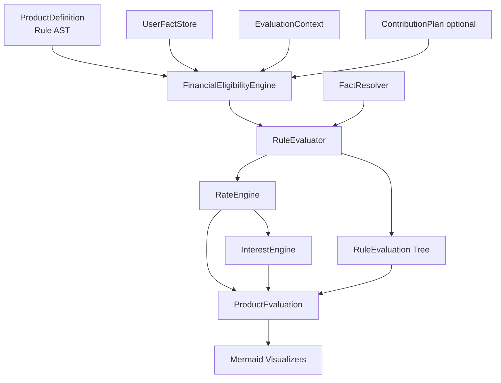

v0.2는 다음 네 종류의 실제 상품조건을 동일한 구조로 처리한다.

- 신한은행 「청년 처음적금」: lookback, 부재조건, 반복 월수, Missing Fact
- 카카오뱅크 「26주적금」: 순서가 있는 연속 자동이체
- IBK기업은행 「IBK부모급여우대적금」: 가입자와 실적 주체의 분리
- 하나은행 「달려라 하나 적금」: 금융회사 고유 서비스와 provenance 분리

현재 구현된 핵심 기능은 다음과 같다.

### Rule DSL

- `AND / OR / NOT`
- `FACT_COMPARE / DERIVED_COMPARE`
- `EXISTS / NOT_EXISTS`
- `ENTITY_COUNT`
- `COUNT_DISTINCT_PERIODS(DAY|WEEK|MONTH)`
- `COUNT_DISTINCT_MONTHS` 호환 alias
- `COUNT_CONSECUTIVE`
- 동적 날짜 표현식
- TimeWindow
- coverage-aware absence

### Fact Model

- `UserFact`
- `AccountHoldingInterval`
- `PersonRelationship`
- `ScheduledOccurrence`
- `DataCoverage`
- `AccountLifecycleEvent`
- `NormalizedMonetaryAmount`

### 판정 및 결과

- `SATISFIED`
- `ACHIEVABLE`
- `UNSATISFIABLE`
- `UNKNOWN`
- `reason_code`
- `progress`
- `missing_facts`
- `evidence`
- `source_provenance`
- 광고 최고금리
- 현재 확정금리
- 실현 가능 금리
- 사용자별 조건부 상한
- 예상 세전·세후이자
- Evaluation Trace / User Fact / Product Rule Mermaid

## 1.2 아직 구현되지 않은 범위

| 영역 | 상태 |
|---|---|
| LLM Gateway | 미구현 |
| PDF Rule Extraction | 미구현 |
| 자연어 Intent Parser | 미구현 |
| Missing Fact Question Generator | 미구현 |
| Result Explainer | 미구현 |
| Append-only Audit Log | 미구현 |
| Future Intent semantic type | 미구현 |
| GoalInstance / Goal Tracker | 미구현 |
| Alert Engine | 미구현 |
| 다상품 검색·Ranking | 미구현 |
| Net Benefit Engine | 미구현 |
| Web UI | 미구현 |

---

# 2. v0.3 핵심 원칙

## 2.1 Financial Eligibility Engine은 계속 LLM 독립적이다

LLM은 금융판정 커널을 대체하지 않는다.

```text
LLM
= 자연어와 구조화된 시스템 사이의 인터페이스

Financial Eligibility Engine
= 가입조건·시간·집계·금리의 실제 판정기
```

다음과 같은 자유형 판정을 LLM에 맡기지 않는다.

> “이 사용자는 이 상품의 조건을 충족합니까?”

LLM은 Rule 초안, Structured Intent, 사용자 질문, 설명문을 생성할 수 있지만 최종 판정과 숫자 계산은 기존 Engine이 수행한다.

## 2.2 LLM이 모든 Graph를 읽지 않는다

LLM은 Product Rule Store, Institution Service KG, User Fact Store 전체를 prompt로 전달받지 않는다.

용도별로 필요한 최소 context만 전달한다.

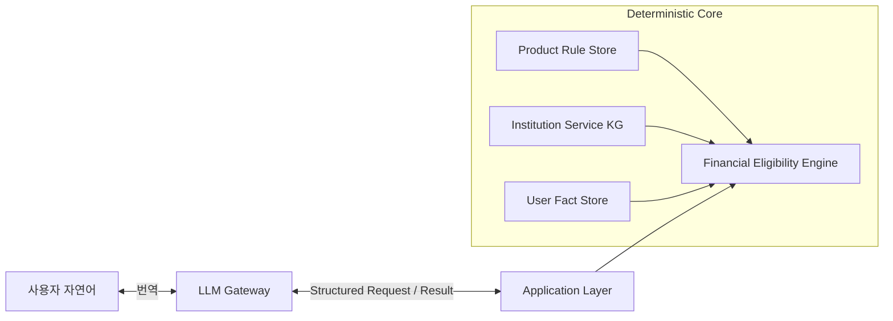

상품 Rule AST는 이미 실행 의미를 가지므로 LLM이 매 요청마다 다시 해석하지 않는다.

## 2.3 가입 후 미래조건과 과거 사실을 구분한다

다음 조건은 가입 전에 과거 실적을 조회하는 조건이 아니다.

- 가입 후 월급봉투 인정월 6개월
- 가입 후 하루 30,000보 이상 달성일 300일
- 가입 후 자동이체 26회 연속 성공
- 가입 후 SuperSOL 회원상태 유지

가입 전에는 다음을 평가한다.

1. 목표를 달성할 시간이 충분한가
2. 구조적인 선행조건이 충족 가능한가
3. 사용자가 해당 행동을 수행하고 추적할 의향이 있는가

가입 후에는 실제 progress와 남은 기회를 추적한다.

## 2.4 ACHIEVABLE의 의미

`ACHIEVABLE`은 다음과 같이 정의한다.

> 현재 확인된 정보, 남은 기간, 선행조건, 사용자의 명시적인 수행 의향을 기준으로 상품 규칙상 달성 경로가 열려 있음. 실제 달성을 예측하거나 보장하지 않음.

사용자 화면에는 다음과 같이 표시한다.

> 계획대로 조건을 달성할 경우 적용 가능한 금리

다음 표현은 사용하지 않는다.

- 보장되는 금리
- 반드시 받게 될 금리
- 달성할 것으로 예측되는 금리

## 2.5 Audit Log와 Evaluation Trace를 분리한다

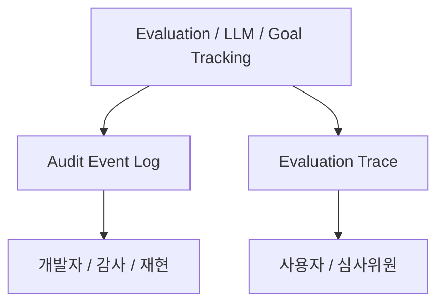

- **Audit Event Log:** 모든 내부 처리단계 기록
- **Evaluation Trace:** 사용자에게 필요한 핵심 판정근거

두 기록은 `request_id / evaluation_id / trace_id`로 연결한다.

---

# 3. 목표 전체 아키텍처

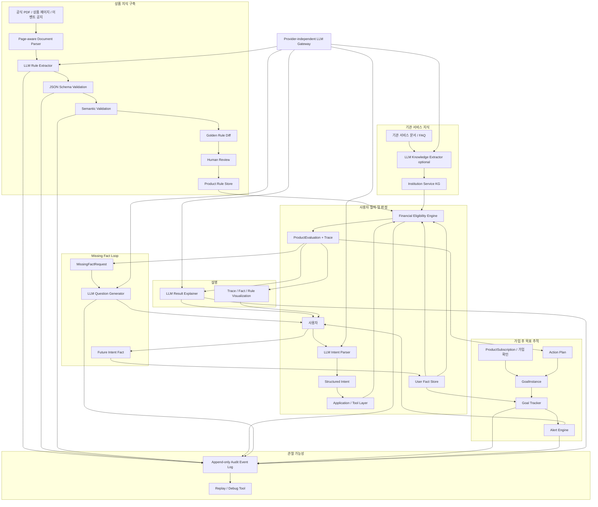

---

# 4. LLM Gateway

## 4.1 목표

- 로컬 모델 서버와 외부 API 교체 가능
- Engine과 모델 공급자 분리
- Structured Output 강제
- 재시도·타임아웃·에러 정규화
- 모든 호출의 Audit metadata 기록
- 테스트에서 Mock Provider 사용 가능

## 4.2 공통 Interface

```python
class LLMClient(Protocol):
    def generate_text(
        self,
        request: TextGenerationRequest,
    ) -> TextGenerationResponse:
        ...

    def generate_structured(
        self,
        request: StructuredGenerationRequest,
        response_model: type[T],
    ) -> StructuredGenerationResponse[T]:
        ...

    def health_check(self) -> LLMHealthStatus:
        ...
```

## 4.3 초기 Adapter

```text
OpenAICompatibleAdapter
MockLLMAdapter
CustomHTTPAdapter optional
```

`OpenAICompatibleAdapter`는 동일한 HTTP contract를 제공하는 로컬 서버와 외부 API에서 공통으로 사용할 수 있다.

## 4.4 환경변수

```text
LLM_PROVIDER
LLM_BASE_URL
LLM_MODEL
LLM_API_KEY
LLM_TIMEOUT_SECONDS
LLM_MAX_RETRIES
LLM_TEMPERATURE
LLM_LOG_PAYLOAD_MODE
```

API Key와 인증정보는 로그에 남기지 않는다.

## 4.5 용도별 Profile

| Profile | 입력 | 출력 | 제약 |
|---|---|---|---|
| `RULE_EXTRACTION` | 문서 section + schema | Rule Knowledge Draft | structured only |
| `SERVICE_EXTRACTION` | 서비스 문서 | Service Draft | structured only |
| `INTENT_PARSING` | 사용자 질문 | Structured Intent | structured only |
| `QUESTION_GENERATION` | MissingFactRequest | 사용자 질문 | 사실 추가 금지 |
| `RESULT_EXPLANATION` | Evaluation Trace | 설명문 | Trace 밖 사실 금지 |

---

# 5. Rule Extractor 출력 Contract

## 5.1 출력 구성

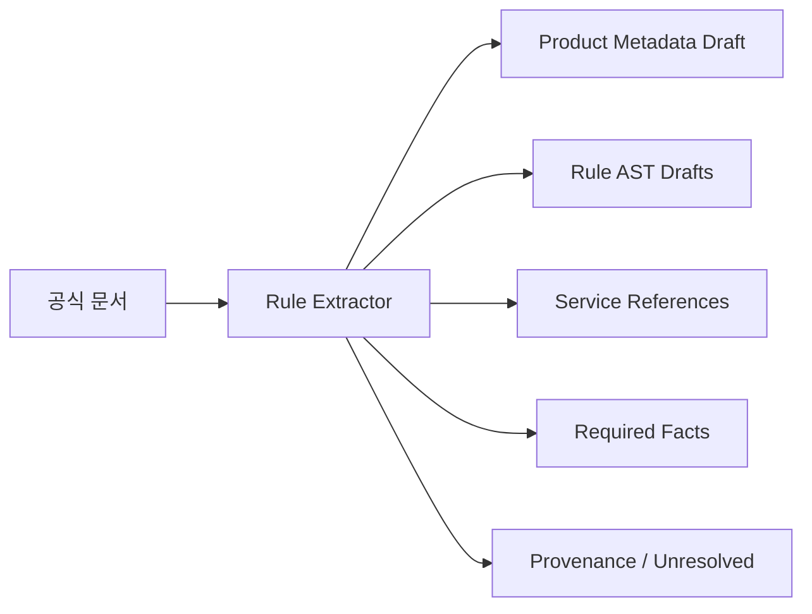

Extractor는 AST만 반환하지 않는다.

```json
{
  "document_id": "...",
  "product_metadata": {},
  "rules": [],
  "service_references": [],
  "required_facts": [],
  "unresolved_items": [],
  "warnings": [],
  "extraction_metadata": {}
}
```

## 5.2 Service Reference

```json
{
  "institution_id": "SHINHAN_BANK",
  "service_name": "급여클럽",
  "concept_name": "월급봉투",
  "reference_type": "REQUIRES_SERVICE_DEFINITION",
  "source": {}
}
```

## 5.3 Required Fact

```json
{
  "fact_type": "SHINHAN_SALARY_CLUB_ENVELOPE_RECEIVED",
  "semantic_type": "OBSERVED_EVENT",
  "authority_hint": "INSTITUTION_SERVICE",
  "used_by_rule_ids": [
    "RATE_SALARY_ENVELOPE_6M"
  ]
}
```

## 5.4 Unresolved Item

```json
{
  "issue_type": "EXTERNAL_DEFINITION_REQUIRED",
  "description": "월급봉투의 인정기준은 급여클럽 서비스 문서가 필요함",
  "related_rule_ids": [
    "RATE_SALARY_ENVELOPE_6M"
  ],
  "source": {}
}
```

## 5.5 금지사항

다음과 같은 기관 전용 DSL operator를 만들지 않는다.

```text
HAS_SHINHAN_SALARY_ENVELOPE
HAS_HANA_HEALTH_ASSET
IS_IBK_REGISTERED_FAMILY
```

기관 고유 개념은 Service Reference와 Fact로 분리하고, Rule AST에는 범용 연산만 사용한다.

## 5.6 Rule Activation

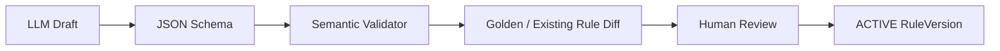

LLM 출력은 바로 ACTIVE 상태로 전환할 수 없다.

---

# 6. Fact Semantic Type

v0.3에서는 이미 발생한 사실과 앞으로의 의향을 구분한다.

```text
OBSERVED_FACT
OBSERVED_EVENT
DERIVED_FACT
FUTURE_INTENT
```

| Type | 예시 | 주된 출처 |
|---|---|---|
| `OBSERVED_FACT` | 현재 카드 보유, 회원상태 | 기관/MyData |
| `OBSERVED_EVENT` | 월급봉투 수령, 날짜별 걸음수 | 기관 서비스 |
| `DERIVED_FACT` | 가입일 나이, 환산금액 | deterministic resolver |
| `FUTURE_INTENT` | 급여계좌 변경 의향, 목표 추적 의향 | 사용자 |

```json
{
  "fact_type": "WILL_COMPLETE_HIGH_STEP_TARGET",
  "semantic_type": "FUTURE_INTENT",
  "value": true,
  "source_type": "USER_DECLARED",
  "subject_person_id": "USER_001",
  "valid_from": "2026-08-20"
}
```

사용자가 하겠다고 답한 사실을 과거 관측실적으로 변환하지 않는다.

---

# 7. Future Achievement Model

## 7.1 Evaluation Phase

```text
PRE_SUBSCRIPTION
POST_SUBSCRIPTION
BOTH
```

- `PRE_SUBSCRIPTION`: 가입 전에 완료되어야 함
- `POST_SUBSCRIPTION`: 가입 후 계약기간에 달성
- `BOTH`: 가입 전 상태와 가입 후 유지가 모두 필요

## 7.2 Achievement Mode

```text
ACCUMULATIVE
CONSECUTIVE
MAINTAIN_UNTIL_DEADLINE
ONE_TIME_BEFORE_DEADLINE
```

| Mode | 예시 |
|---|---|
| `ACCUMULATIVE` | 월급봉투 6개월, 3만보 300일 |
| `CONSECUTIVE` | 자동이체 26회 연속 성공 |
| `MAINTAIN_UNTIL_DEADLINE` | SuperSOL 상태 유지 |
| `ONE_TIME_BEFORE_DEADLINE` | 최초 로그인, 마케팅 동의 |

## 7.3 일반화된 FutureAchievementSpec

v0.2의 월 단위 전용 개념을 일·주·월 공통 구조로 일반화한다.

```json
{
  "intent_fact_type": "WILL_ATTEMPT_RULE_001",
  "missing_fact": {
    "resolution_strategy": "ASK_USER"
  },
  "capability_rule": {},
  "achievement_mode": "ACCUMULATIVE",
  "max_qualifying_units_per_opportunity": 1,
  "action": {},
  "goal_template": {}
}
```

## 7.4 상태 전이

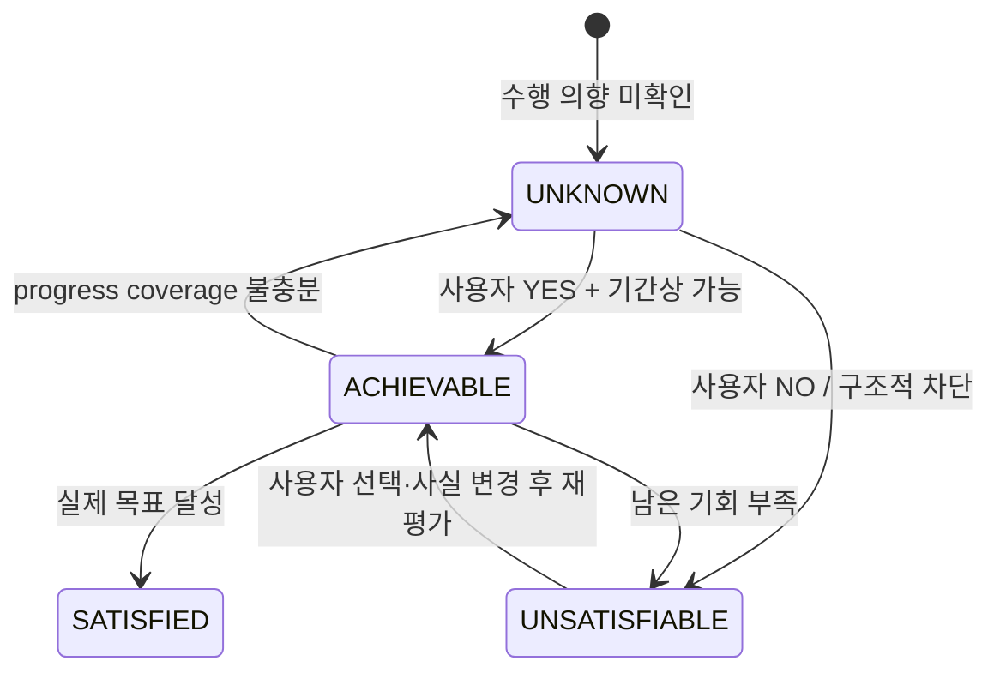

사용자가 조건을 거부한 경우 MVP에서는:

```text
status = UNSATISFIABLE
reason_code = USER_DECLINED
```

로 실현 가능 금리에서 제외한다. UI에서는 **선택하지 않음**으로 표시한다.

---

# 8. 월급봉투 6개월 처리

## 8.1 Product Rule

```text
COUNT_DISTINCT_PERIODS(
  period = MONTH,
  fact_type = SHINHAN_SALARY_CLUB_ENVELOPE_RECEIVED,
  window = [START_OF_SUBSCRIPTION_MONTH, END_OF_QUALIFYING_WINDOW]
) >= 6
```

월급봉투가 무엇인지와 어떤 이벤트가 수령으로 인정되는지는 Institution Service KG가 관리한다.

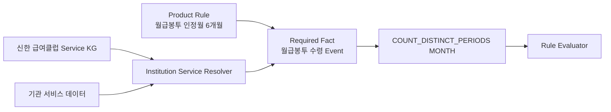

## 8.2 가입 전 판정

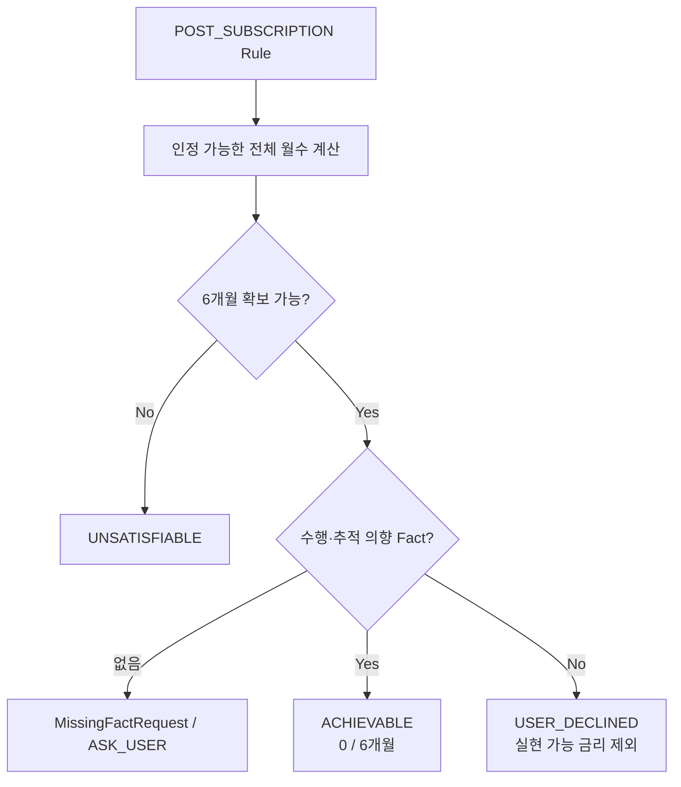

사용자 질문:

> 이 상품의 주거래 우대금리 +1.0%p를 받으려면 가입 후 월급봉투 인정조건을 6개월 이상 달성해야 합니다. 이 조건을 목표로 관리할까요?

## 8.3 가입 후 추적

```text
current_progress = 4 months
required = 6 months
remaining_required = 2 months
remaining_opportunities = 2 months
```

알림:

> 앞으로 남은 2개월을 모두 달성해야 +1.0%p 조건을 받을 수 있습니다.

---

# 9. 하루 30,000보 이상 300일 처리

이 조건은 사용자가 제시한 **가상 stress-test**다.

## 9.1 Product Rule

```text
COUNT_DISTINCT_PERIODS(
  period = DAY,
  fact_type = QUALIFIED_DAILY_STEP_METRIC,
  filters = DAILY_STEPS >= 30000,
  window = [subscription_date, maturity_date]
) >= 300
```

## 9.2 Resolver

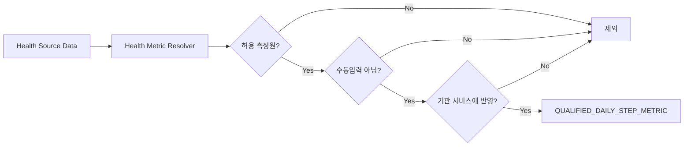

## 9.3 가입 전 판정

```text
available_days = 365
required_days = 300
available_days >= required_days
```

사용자 질문:

> 가입 후 하루 30,000보 이상 달성한 날을 300일 이상 만들어야 합니다. 이 조건을 목표로 관리할까요?

YES인 경우:

```text
status = ACHIEVABLE
progress = 0 / 300 DAY
basis = USER_COMMITTED + TIME_FEASIBLE
```

## 9.4 가입 후 위험도

```text
current = 170
required_remaining = 130
remaining_opportunities = 150
buffer = 20
```

알림:

> +2.0%p 조건을 위해 130일이 더 필요합니다. 남은 기간 중 최대 20일까지 놓칠 수 있습니다.

다음 경우:

```text
required_remaining = 51
remaining_opportunities = 50
```

결과:

```text
status = UNSATISFIABLE
reason_code = INSUFFICIENT_REMAINING_OPPORTUNITIES
```

---

# 10. Action Plan과 Goal Tracking

## 10.1 가입 전과 가입 후의 구분

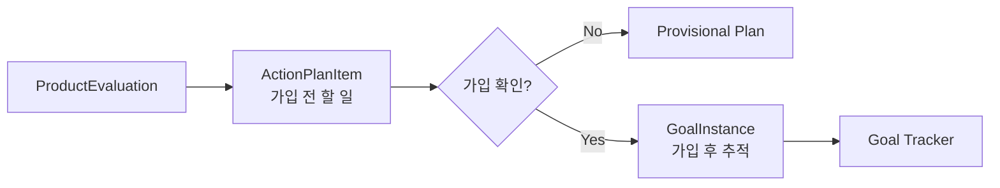

가입은 다음으로 확인할 수 있다.

- 기관 API
- MyData ProductSubscription
- MVP에서는 사용자 확인

## 10.2 ActionPlanItem

```text
action_plan_item_id
user_id
product_id
rule_id
action_id
description
deadline
rate_reward_pp
estimated_value
status
```

예:

- 가입 전 SuperSOL 최초 로그인
- 마케팅 동의
- 카드 결제계좌 변경

## 10.3 GoalInstance

```text
goal_id
user_id
product_id
subscription_id
rule_id
tracking_mode
metric
required_target
current_progress
window_start
deadline
remaining_required
remaining_opportunities
buffer
rate_reward_pp
estimated_reward_value
status
next_check_at
alert_policy
created_from_evaluation_id
```

## 10.4 Goal Status

```text
ACTIVE
AT_RISK
COMPLETED
FAILED
PAUSED
```

Goal Status는 Rule Evaluation Status와 다르다.

| Rule Status | Goal Status |
|---|---|
| `ACHIEVABLE` | `ACTIVE`, `AT_RISK` |
| `SATISFIED` | `COMPLETED` |
| `UNSATISFIABLE` | `FAILED` |
| `UNKNOWN` | Goal 생성 보류 |

## 10.5 Goal 생성 조건

1. `POST_SUBSCRIPTION` 또는 `BOTH` Rule
2. Rule status가 `ACHIEVABLE`
3. 사용자가 추적에 동의
4. 실제 가입 또는 가입예정 상태 확인
5. Goal template 존재

---

# 11. Alert Engine

## 11.1 Alert Type

```text
ACTION_REQUIRED
UPCOMING_OCCURRENCE
PROGRESS_UPDATE
DEADLINE_APPROACHING
AT_RISK
CRITICAL
COMPLETED
FAILED
DATA_SYNC_REQUIRED
```

## 11.2 Deterministic Trigger

LLM은 문장을 자연스럽게 바꿀 수 있지만, 알림 발생 여부와 심각도는 코드가 계산한다.

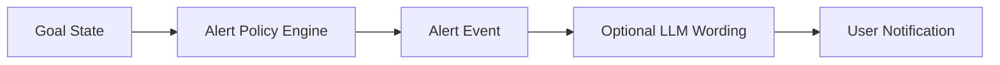

## 11.3 누적형 위험 계산

```text
buffer = remaining_opportunities - remaining_required
```

- `buffer > safety_threshold`: ACTIVE
- `0 < buffer <= safety_threshold`: AT_RISK
- `buffer = 0`: CRITICAL
- `buffer < 0`: FAILED

## 11.4 연속형 알림

예:

> 내일 4회차 자동이체 예정입니다. 이번 회차가 실패하면 +1.0%p 조건을 받을 수 없습니다.

연속형 추적에는 다음 정보가 추가로 필요하다.

```text
expected_occurrence_count
observation_horizon
occurrence-domain DataCoverage
SCHEDULED / SUCCESS / FAILED 상태
```

---

# 12. Audit Event Log

## 12.1 Event Type

```text
REQUEST_RECEIVED
DOCUMENT_PARSED
LLM_CALL_STARTED
LLM_CALL_COMPLETED
LLM_CALL_FAILED
SCHEMA_VALIDATION_COMPLETED
SEMANTIC_VALIDATION_COMPLETED
HUMAN_REVIEW_RECORDED
RULE_LOADED
DATE_EXPRESSION_RESOLVED
FACT_REQUESTED
FACT_CANDIDATES_FOUND
FACT_SOURCE_SELECTED
FACT_CONFLICT_DETECTED
SERVICE_RESOLVER_CALLED
DATA_COVERAGE_CHECKED
AGGREGATION_EXECUTED
COMPARISON_EXECUTED
FUTURE_CAPACITY_CHECKED
MISSING_FACT_CREATED
USER_FACT_RECEIVED
STATUS_DERIVED
REWARD_APPLIED
RATE_SUMMARY_CREATED
GOAL_CREATED
GOAL_PROGRESS_UPDATED
GOAL_FEASIBILITY_RECALCULATED
ALERT_TRIGGERED
RESULT_EXPLAINED
```

## 12.2 AuditEvent Schema

```json
{
  "event_id": "...",
  "occurred_at": "...",
  "request_id": "...",
  "evaluation_id": "...",
  "trace_id": "...",
  "span_id": "...",
  "parent_span_id": "...",
  "component": "RULE_EVALUATOR",
  "event_type": "AGGREGATION_EXECUTED",
  "entity_refs": {},
  "input_hash": "...",
  "output_hash": "...",
  "payload": {},
  "provenance": []
}
```

## 12.3 월급봉투 처리 로그

사용자 답변 전:

```text
RULE_LOADED
TIME_WINDOW_RESOLVED
FACT_REQUESTED
FACT_NOT_FOUND
MISSING_FACT_CREATED(strategy=ASK_USER)
STATUS_DERIVED(status=UNKNOWN)
```

사용자 YES 이후:

```text
USER_FACT_RECEIVED(semantic_type=FUTURE_INTENT)
RE_EVALUATION_STARTED
FUTURE_CAPACITY_CHECKED(result=POSSIBLE)
STATUS_DERIVED(status=ACHIEVABLE)
REWARD_APPLIED(include_in_realizable_rate=true)
```

---

# 13. LLM Audit

다음 metadata를 기록한다.

```text
purpose
provider
base_url identifier
model
model_version
prompt_template_id
prompt_template_version
response_schema_version
input_document_id
input_document_hash
input_context_hash
output_hash
latency_ms
token_usage
retry_count
schema_validation_result
semantic_validation_result
error_code
```

## 13.1 Payload 정책

```text
LLM_LOG_PAYLOAD_MODE = NONE | HASHED | REDACTED | FULL_DEBUG
```

기본 원칙:

- API Key 저장 금지
- 개인정보 raw prompt 저장 금지
- 사용자 데이터는 reference/hash 중심
- 문서 원문은 document reference로 연결
- 가상데이터 환경에서만 `FULL_DEBUG` 허용

---

# 14. LLM 용도별 처리

## 14.1 Rule Extraction

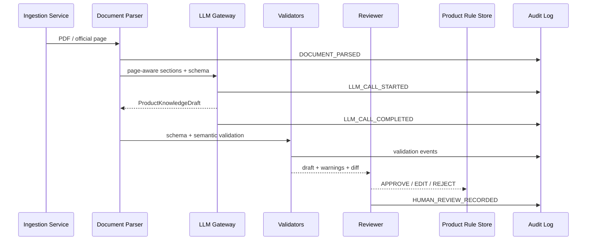

## 14.2 Missing Fact Question

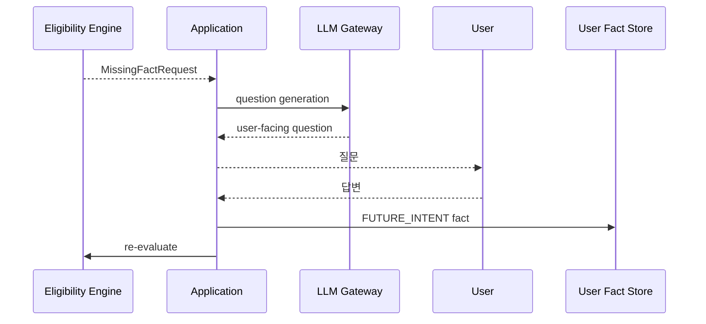

## 14.3 Result Explanation

LLM에는 다음만 전달한다.

- ProductEvaluation
- 선택된 Trace subtree
- 관련 provenance
- 사용자에게 공개할 계산 가정

전체 Graph나 User Fact Store를 전달하지 않는다.

LLM은 다음을 새로 계산할 수 없다.

- 조건 상태
- 금리
- 이자
- 남은 기회
- Net Benefit
- Rule source

---

# 15. Application Tool Contract

초기 Tool 후보:

```text
search_products
get_product
get_product_rule_summary
evaluate_product
get_missing_facts
submit_user_fact
get_evaluation_trace
get_service_definition
create_goal_from_evaluation
get_goal_status
```

예:

```json
{
  "tool": "evaluate_product",
  "arguments": {
    "product_id": "SHINHAN_YOUTH_FIRST_SAVINGS",
    "user_id": "U001",
    "subscription_date": "2026-08-20"
  }
}
```

LLM은 Tool 실행 결과를 설명하며, 직접 DB query 또는 자유로운 Graph traversal을 만들지 않는다.

---

# 16. 데이터·보안 경계

## 16.1 Engine은 LLM 네트워크 호출을 하지 않는다

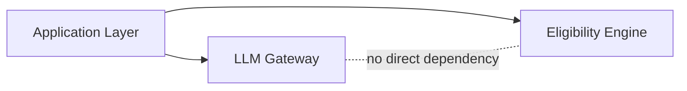

`FinancialEligibilityEngine.evaluate_product()`는 deterministic core로 유지한다.

## 16.2 최소 Context

- Rule Extractor: 관련 문서 section만
- Intent Parser: 질문과 intent schema만
- Question Generator: MissingFactRequest만
- Result Explainer: Trace subtree만

## 16.3 외부 API 전송정보

- pseudonymous user ID
- 최소한의 관련 Fact만
- 계좌번호·주민번호·실명 제외
- provenance raw payload 대신 reference 사용

---

# 17. 테스트 전략

## 17.1 기존 회귀

v0.2의 기존 테스트는 모두 유지한다.

## 17.2 LLM Gateway

```text
test_mock_provider_structured_output
test_openai_compatible_adapter_timeout
test_provider_error_normalization
test_schema_validation_failure
test_api_key_not_logged
```

## 17.3 Rule Extractor Golden Set

1. 신한 청년 처음적금
2. 카카오 26주적금
3. IBK 부모급여우대적금
4. 하나 달려라 하나 적금

평가항목:

- Rule recall
- AND/OR/NOT scope
- time anchor
- aggregation target
- reward 연결
- Service Reference 분리
- Required Fact 정확도
- provenance 페이지·조항
- hallucinated rule 수
- unresolved item recall

## 17.4 Future Intent

```text
test_post_subscription_rule_missing_intent_returns_unknown
test_user_yes_and_time_feasible_returns_achievable
test_user_no_excludes_reward_from_realizable_rate
test_insufficient_opportunities_returns_unsatisfiable
test_future_intent_never_becomes_observed_fact
```

## 17.5 Goal Tracking

```text
test_monthly_accumulative_goal_progress
test_daily_accumulative_buffer
test_consecutive_goal_failure
test_maintain_until_deadline_risk
test_goal_created_only_after_subscription_confirmation
```

## 17.6 Audit

```text
test_audit_events_are_append_only
test_evaluation_and_llm_share_trace_id
test_fact_source_selection_is_logged
test_aggregation_inputs_and_result_are_logged
test_replay_reproduces_status
test_default_log_redacts_sensitive_payload
```

---

# 18. v0.3 Sprint 범위

## MUST

- Provider-independent LLM Gateway
- Mock Provider
- 하나 이상의 OpenAI-compatible Adapter
- `RULE_EXTRACTION` structured call
- ProductKnowledgeDraft schema
- page/section provenance 유지
- JSON Schema Validator
- 최소 Semantic Validator
- append-only Audit Event Log
- `request_id / evaluation_id / trace_id`
- FactSemanticType
- 가입 후 조건의 Missing Fact → 사용자 응답 → 재평가 흐름
- 월급봉투 6개월 Golden Flow
- 하루 30,000보 이상 300일 synthetic stress test
- GoalInstance 최소 모델
- 누적형 Goal progress와 위험 계산

## SHOULD

- Result Explainer
- Question Generator
- CONSECUTIVE Goal Tracking
- Alert Event
- Audit Replay CLI
- Provider Health Check CLI

## NOT REQUIRED

- 전체 Web UI
- 실제 Push 인프라
- 실제 MyData API
- 모든 상품 자동수집
- Neo4j
- Vector DB / Graph RAG
- LLM Planner
- 사람 검토 없는 Rule 자동 활성화

---

# 19. 수용 기준

1. v0.2 회귀테스트가 모두 통과한다.
2. Engine은 LLM 없이 기존 판정을 계속 수행한다.
3. 로컬/외부 API를 설정만으로 교체할 수 있다.
4. Rule Extractor 결과가 schema를 통과하지 못하면 저장되지 않는다.
5. 문서에 없는 Rule은 validation 또는 review에서 탐지 가능하다.
6. 월급봉투 6개월이 `UNKNOWN → 사용자 질문 → ACHIEVABLE`로 진행된다.
7. 3만보 300일은 시간상 가능 여부와 사용자 의향을 분리한다.
8. 가입 후 progress와 남은 기회를 deterministic하게 계산한다.
9. LLM·Resolver·Evaluator·Rate·Goal·Alert가 하나의 trace chain으로 연결된다.
10. 이상 결과의 발생 단계를 Audit Log로 식별할 수 있다.
11. Evaluation Trace에는 내부 debug 정보를 과도하게 노출하지 않는다.
12. LLM은 금리·이자·상태를 임의로 생성하지 않는다.

---

# 20. 구현 순서

```mermaid
flowchart LR
    A[1. Audit Event Schema / Sink] --> B[2. LLM Gateway / Mock Adapter]
    B --> C[3. Provider Adapter]
    C --> D[4. ProductKnowledgeDraft]
    D --> E[5. Rule Extractor Pilot]
    E --> F[6. Schema / Semantic Validation]
    F --> G[7. Future Intent Semantic Type]
    G --> H[8. 월급봉투 6개월 Flow]
    H --> I[9. 3만보 300일 Stress Test]
    I --> J[10. GoalInstance / Tracker]
    J --> K[11. Alert Event]
    K --> L[12. Result Explanation optional]
```

Audit 기반을 먼저 구현하는 이유는 이후 LLM 실험이 실패했을 때 원인을 재현하기 위해서다.

---

# 21. 동결 사항

## 동결

- Engine은 LLM 독립 deterministic core
- LLM은 Gateway를 통해서만 사용
- Local Server / External API 모두 지원
- LLM은 전체 Graph가 아닌 최소 context와 Tool 결과를 사용
- Extractor 출력은 AST + Service Reference + Required Fact + Provenance + Unresolved
- Future Intent와 Observed Fact 분리
- ACHIEVABLE은 달성 가능 경로이며 달성 보장이 아님
- 가입 후 조건은 GoalInstance로 추적
- Alert Trigger는 deterministic
- Audit Log와 Evaluation Trace 분리
- 모든 처리단계를 공통 trace identifier로 연결

## 미동결

- 최종 LLM 모델
- 최종 외부 API 공급자
- Production DB
- 알림 채널
- 최종 UI framework
- Graph DB
- Vector Search
- LLM Planner
- Net Benefit 고도화 방식

---

# 22. 열린 이슈

## 22.1 사용자 거부 상태

MVP에서는 `UNSATISFIABLE / USER_DECLINED`로 실현 가능 금리에서 제외하고 UI에는 “선택하지 않음”으로 표시한다.

추후 필요하면 Rule Status와 Plan Disposition을 분리한다.

## 22.2 극단적으로 어려운 조건

사용자 YES를 성공 확률로 해석하지 않는다.

```text
Rule Eligibility
≠ Goal Success Probability
```

달성 확률 예측이 필요하면 별도 모델로 설계한다.

## 22.3 미도래 Schedule

실시간 연속조건에는 다음이 필요하다.

- schedule definition
- expected occurrence count
- observation horizon
- occurrence-domain coverage

## 22.4 기관 서비스 데이터 미연동

실제 progress를 확인할 수 없으면 `DATA_SYNC_REQUIRED`를 반환한다. 사용자의 과거 실적 self-attestation을 authoritative truth로 사용하지 않는다.

---

# 23. 최종 판단

## GO — LLM Integration & Audit Sprint 착수 가능

v0.2 deterministic core는 서로 다른 금융상품 조건을 동일한 구조로 처리했고, 아키텍처의 대규모 재설계가 필요하지 않았다.

다음 단계의 목표는 LLM에게 금융판정을 맡기는 것이 아니다.

```text
공식 문서
→ LLM Rule Draft
→ Validation / Human Review
→ Product Rule Store
→ Deterministic Eligibility Engine
→ Evaluation Trace
→ Future Intent
→ Goal Tracking / Alert
```

을 하나의 감사 가능한 처리 흐름으로 연결하는 것이다.

v0.3의 핵심 성공조건은 다음과 같다.

> **LLM이 공식 금융문서를 구조화하고 사용자와 자연어로 상호작용하되, 실제 금융조건 판정과 목표 추적은 deterministic하게 수행되며, 모든 과정이 빠짐없이 재현 가능한가?**