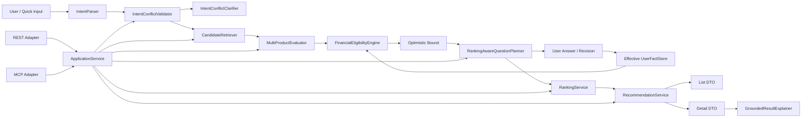

# Financial Eligibility Engine v0.4 — Implementation Report

**Sprint:** Personalized Product Search & Application Layer Implementation  
**기준 코드:** `financial-eligibility-engine-v0.3.2`  
**산출 버전:** `financial-eligibility-engine-v0.4` / Python package `0.4.0`  
**최종 판정:** `READY_FOR_WEB_APPLICATION`  
**작성일:** 2026-08-20

---

## 1. 구현 요약

v0.3.2의 deterministic core를 유지하면서, 개별 상품 평가 결과를 여러 상품에 걸쳐 조합하는 Application Layer를 구현했다.

최종 흐름은 다음과 같이 실제 코드로 연결된다.

```text
사용자 자연어 / Quick Input
→ ProductSearchIntent
→ deterministic IntentConflict validation
→ ProductMetadata 기반 cheap hard filter
→ 여러 상품 FinancialEligibilityEngine.evaluate_product()
→ optimistic upper bound / Top 5 frontier
→ ranking-aware Missing Fact question
→ 사용자 답변 / revision / supersession
→ 영향 상품 재평가
→ realizable-only final ranking
→ Top 5 List DTO
→ Product Detail DTO
→ grounded LLM explanation
→ append-only Audit chain
```

새 business logic은 `ApplicationService`에 모으고, REST와 MCP-style adapter는 동일 서비스를 호출하는 얇은 계층으로 구현했다. Core의 eligibility, status, rate, interest, trace 계산을 Application Layer나 adapter에 복제하지 않았다.

---

## 2. 변경된 Architecture



### 신규 주요 모듈

```text
src/eligibility/application_service.py
src/eligibility/adapters/rest.py
src/eligibility/adapters/mcp.py
src/eligibility/llm/grounding.py
src/eligibility/schema/search.py
src/eligibility/search/intent.py
src/eligibility/search/retrieval.py
src/eligibility/search/contribution.py
src/eligibility/search/evaluation.py
src/eligibility/search/questions.py
src/eligibility/search/ranking.py
src/eligibility/search/recommendation.py
```

### 유지한 핵심 경계

- `FinancialEligibilityEngine`: 개별 상품 deterministic evaluation
- `ApplicationService`: 검색·질문·재평가·Ranking·결과 조립
- LLM: 구조화·wording·설명
- REST/MCP: transport adapter

---

## 3. Core Closure Patch 결과

### 3.1 Question Generator semantic safety

`MissingFactRequest`를 `CanonicalQuestionPayload`로 변환하고, 숫자·기간·금리·금액·횟수·순위를 typed claim으로 관리한다.

```text
MissingFactRequest
→ CanonicalQuestionPayload
→ LLM GeneratedQuestion + ClaimBinding
→ typed value/unit validation
→ financial-condition vocabulary validation
→ deterministic fallback
```

차단하는 예:

```text
6 MONTH → 6 PERCENTAGE_POINT rebinding
source에 없는 신한카드·공과금·통신비 등 금융조건 추가
fact_type / rule_id / action_id / reward_id 변경
```

Result Explainer는 생성문에 숫자 claim이 있으면 exact `ClaimBinding`을 요구한다. claim ID·type·value·unit이 canonical payload와 다르면 deterministic explanation으로 대체한다.

### 3.2 User Answer Revision / Supersession

`UserFact`에 다음 lifecycle metadata를 추가했다.

```text
record_status {ACTIVE, SUPERSEDED}
version
request_reference
supersedes_fact_id
```

`UserFactStore.with_answer_fact()`는 동일 `request_reference`의 기존 사용자 답변을 물리 삭제하지 않고 `SUPERSEDED`로 전환한 뒤 새 Fact를 `ACTIVE`로 append한다.

`FactResolver`는 active Fact만 사용한다. `UserAnswerRecord`와 Audit는 전체 이력을 유지한다.

### 3.3 신한 급여우대 최소 안전 보정

신한 주거래 우대의 현재 구현 경로가 실패하더라도 공식 대체경로가 아직 모델링되지 않았다면 전체 Rule을 `UNSATISFIABLE`로 닫지 않는다.

```text
단일 구현 경로 false
+ alternative_action_paths_complete = false
→ UNKNOWN
→ ALTERNATIVE_ACTION_PATH_NOT_EVALUATED
```

신한 전용 대형 architecture는 추가하지 않았고, `FutureAchievementSpec`의 일반적 metadata로 좁게 처리했다.

---

## 4. 신규 Application Schema

`src/eligibility/schema/search.py`에 다음 typed model을 추가했다.

### Intent / Session

- `ContributionPlan`
- `ProductSearchIntent`
- `IntentConflict`
- `ClarificationRequest`
- `ClarificationResolution`
- `SearchSession`

### Candidate / Question

- `CandidateFilterDecision`
- `ContributionProjection`
- `CandidateEvaluation`
- `RankInterval`
- `QuestionCandidate`
- `PlannedQuestion`
- `TopKStabilityResult`

### Result / Detail

- `RecommendationListItem`
- `RateContribution`
- `RateCapAdjustment`
- `RateBreakdownItem`
- `PersonalizedRecommendationReason`
- `ProductRecommendationDetail`
- `RankingResult`
- `ProductRecommendationResult`

v0.4 JSON Schema 29개를 `schemas/*.v0.4.schema.json`으로 export했다.

---

## 5. Candidate Retrieval Semantics

`CandidateRetriever`는 `ProductMetadata` 중심의 cheap filter다.

### 확실히 제거하는 경우

- `ENDED / SOLD_OUT / SUSPENDED`
- 명시적 product type 불일치
- HARD term 범위 위반
- HARD 납입 capacity 위반
- 명시적 subscription channel exclusion
- 확정적인 hard feature constraint 위반

### 유지하는 경우

- 판매상태 `UNKNOWN`
- eligibility `UNKNOWN`
- 데이터 없음
- 특정 우대조건 `UNSATISFIABLE`
- Capability `CANNOT`
- Preference 불일치

Capability는 ActionPath를 닫을 수 있지만 상품 전체 제거 조건으로 사용하지 않는다.

---

## 6. Optimistic Search Algorithm

각 candidate에 대해 core 결과를 다음 구간으로 보존한다.

```text
confirmed_rate
realizable_rate
user_specific_conditional_upper_rate
```

ContributionPlan이 있으면 다음도 계산한다.

```text
confirmed_after_tax_interest
realizable_after_tax_interest
conditional_upper_after_tax_interest
```

Optimistic upper는 다음 용도로만 사용한다.

- Top 5 진입 가능 frontier 구성
- 질문 ranking impact 계산
- 5위/6위 membership 안정성 판정

최종 List·Detail의 사용자 기준 금리와 final ranking에는 favorable UNKNOWN branch를 포함하지 않는다.

---

## 7. Question Planner Algorithm

`RankingAwareQuestionPlanner`는 `ASK_USER` Missing Fact를 fact type과 semantic type으로 묶는다. 하나의 Fact가 여러 상품에 영향을 주면 하나의 질문에 영향 상품 목록을 연결한다.

투명한 deterministic priority 요소:

```text
ranking_impact
candidate_coverage
eligibility_impact
reward_or_benefit_impact
branch_short_circuit_value
```

고정 질문 예산은 없다.

Pruning:

- 탈락 candidate 전용 질문
- optimistic upper로 Top 5 진입 불가한 candidate 질문
- 이미 만족된 OR branch의 대체 질문
- 답이 eligibility·score·Top 5·설명에 영향을 주지 않는 질문
- `QUERY_INSTITUTION` 등 사용자에게 답을 받을 수 없는 Fact

`answered_question_ids`는 이미 처리한 질문의 반복을 방지한다.

---

## 8. Ranking Semantics

### 탐색과 최종 순위 분리

```text
탐색: optimistic metric
최종: realizable metric
```

### 기본 objective

`MAX_ESTIMATED_AFTER_TAX_INTEREST`

Lexicographic ordering:

1. 실제 납입계획 기준 realizable 세후이자
2. realizable rate
3. preference score
4. action burden 낮은 순
5. material unknown 적은 순
6. eligibility uncertainty tie-break
7. product ID deterministic tie-break

### override

- `MAX_REALIZABLE_RATE`
- `MIN_ACTION_BURDEN`
- `BALANCED`

### Top 5 stability

```text
현재 5위 realizable metric
>
모든 비선정 candidate optimistic metric
```

이면 membership을 안정으로 판정한다. 내부 상위권 순서를 바꿀 material question이 남으면 planner가 계속 질문할 수 있다.

---

## 9. Answer Supersession

Web answer 흐름:

```text
PlannedQuestion
→ UserAnswerSubmission
→ typed UserFact
→ prior ACTIVE answer SUPERSEDED
→ new answer ACTIVE
→ affected products only re-evaluated
→ ranking recalculated
```

Historical replay session에서 wall-clock timestamp가 `as_of`보다 미래가 되어 Fact가 무시되는 문제도 방지했다. 명시적 `answered_at`이 없으면 session `as_of` 날짜에 답변 시각을 정렬한다.

동일 question/fact의 반복 revision을 versioned history로 보존한다.

---

## 10. Intent Conflict Clarification

`IntentConflictValidator`가 다음 충돌을 deterministic하게 탐지한다.

- `CAN / CANNOT`
- 반대 Preference
- `REQUIRE / EXCLUDE`
- HARD numeric lower/upper contradiction
- Hard Constraint vs Preference
- Hard Constraint vs Capability
- active intent update contradiction

`IntentConflictClarifier`는 optional LLM wording layer다. LLM이 `conflict_ids`나 `allowed_resolutions`를 변경하면 deterministic clarification으로 fallback한다.

Resolution 적용 시 `intent_version`을 증가시키고 전체 이력을 Audit에 남긴다.

---

## 11. List / Detail Contract

### List DTO

각 카드:

```text
rank
institution_name
product_name
product_type
realizable_rate
advertised_max_rate
term_summary
contribution_summary
maximum_deposit_summary
planned_contribution_summary
estimated_total_principal
estimated_after_tax_interest
eligibility_badge
verification_badge
material_unknown_count
```

### Detail DTO

상단 Summary:

```text
rank
confirmed_rate
realizable_rate
advertised_max_rate
term / contribution / maximum / plan
estimated principal
pre-tax / after-tax interest
```

조건별 breakdown:

```text
rule_id
rule_label
nominal_reward_pp
status
verification_level
evidence_basis
action_summary
reason_code
source_reference
```

Structured recommendation reason을 먼저 생성한 뒤 LLM은 이를 자연어로 표현한다.

---

## 12. Rate Breakdown / Cap Handling

Rule별 nominal reward를 보존하고, 다음 bucket 포함 여부를 표시한다.

```text
confirmed
realizable
conditional upper
```

상품 cap 적용순서가 공식 문서에 없으면 per-rule credited amount를 임의로 만들지 않는다.

```text
pre_cap_total_pp
cap_pp
cap_reduction_pp
post_cap_total_pp
```

를 aggregate `RateCapAdjustment`로 제공한다.

Synthetic cap test에서:

```text
0.75 + 0.75 = 1.50%p eligible
cap = 1.00%p
cap reduction = 0.50%p
post-cap = 1.00%p
```

를 검증했다.

---

## 13. LLM Grounding

### Question Generator

- typed value/unit claims
- allowed financial-condition terms
- required grounding terms
- deterministic identifiers
- deterministic fallback

### Intent Clarification

- exact conflict IDs
- exact allowed resolutions
- option mutation 시 fallback

### Result Explainer

허용 입력:

- ProductMetadata
- ProductEvaluation
- rate breakdown
- Ranking result
- selected evidence/action/provenance
- deterministic calculation assumptions

차단:

- numeric claim 변경
- 금리·이자 재계산
- `UNKNOWN` 확정
- `ACHIEVABLE` 보장 표현
- source에 없는 조건 추가
- rank 변경

숫자가 포함된 explanation은 canonical claim binding이 없거나 맞지 않으면 fallback한다.

---

## 14. REST / MCP 구현 범위

### REST adapter

Framework-neutral endpoint contract:

```text
POST  /search-sessions
GET   /search-sessions/{id}
POST  /search-sessions/{id}/clarifications
GET   /search-sessions/{id}/questions/next
POST  /search-sessions/{id}/answers
PATCH /search-sessions/{id}/answers/{request_reference}
PATCH /search-sessions/{id}/intent
GET   /search-sessions/{id}/recommendations
GET   /search-sessions/{id}/recommendations/{product_id}
GET   /search-sessions/{id}/trace
```

### MCP-style adapter

```text
search_products
get_search_status
get_next_question
submit_user_fact
revise_user_fact
update_search_intent
get_top_recommendations
get_product_detail
get_evaluation_trace
```

MCP SDK는 추가하지 않았다. 현재 repo에 과도한 dependency를 넣지 않고 thin contract를 제공했다. REST와 MCP가 같은 `ApplicationService` state와 결과를 공유하는 contract test를 추가했다.

---

## 15. Audit 확장

신규 context identifier:

```text
search_session_id
intent_version
ranking_run_id
question_id
recommendation_id
```

기존:

```text
request_id
evaluation_id
trace_id
```

와 함께 하나의 chain을 구성한다.

신규 event:

```text
SEARCH_SESSION_CREATED
SEARCH_INTENT_PARSED
SEARCH_INTENT_UPDATED
INTENT_CONFLICT_DETECTED
CLARIFICATION_REQUESTED
CLARIFICATION_RESOLVED
CANDIDATE_FILTERED
CANDIDATE_RETAINED
CANDIDATE_EVALUATED
OPTIMISTIC_BOUND_CALCULATED
QUESTION_CANDIDATE_SCORED
QUESTION_SELECTED
USER_ANSWER_SUPERSEDED
RANKING_CALCULATED
TOP_K_STABILITY_CHECKED
RECOMMENDATION_CREATED
PRODUCT_DETAIL_OPENED
EXPLANATION_GENERATED
```

`examples/v0.4/official-fixture-search-flow.json`과 `adversarial-results-v0.4.json`에서 실제 trace를 확인할 수 있다.

---

## 16. 신규 테스트

v0.4 전용 테스트는 **50개**다.

```text
tests/test_v04_core_closure.py
tests/test_v04_intent_and_retrieval.py
tests/test_v04_optimistic_and_questions.py
tests/test_v04_ranking_and_views.py
tests/test_v04_interactive_and_adapters.py
```

요구된 44개 named test를 모두 포함한다. 추가로 다음을 검증한다.

- answer revision history audit
- hard contribution capacity filtering
- LLM clarification resolution-option mutation rejection
- hard/capability resolution의 원래 capability ID 유지
- exact-bound LLM explanation acceptance
- REST/MCP shared service

---

## 17. 전체 테스트 결과

### Baseline

```text
v0.3.2 baseline before modification: 176 passed
```

기록:

```text
reports/baseline-v0.3.2-before-v0.4.txt
```

### 기존 v0.3.2 regression on v0.4

```text
176 passed
```

기록:

```text
reports/v0.3.2-regression-on-v0.4.txt
```

### v0.4 acceptance tests

```text
50 passed
```

기록:

```text
reports/acceptance-tests-v0.4.txt
```

### 전체 suite

```text
226 passed
```

기록:

```text
reports/test-results-v0.4-detailed.txt
```

### Compile / Import / Build

```text
compileall: PASS
package version: 0.4.0
wheel build: PASS
wheel install/import: PASS
```

wheel:

```text
dist/financial_eligibility_engine-0.4.0-py3-none-any.whl
```

최종 검증 요약:

```text
reports/final-validation-v0.4.txt
```

---

## 18. 직접 수행한 Adversarial Tests

### Question hallucination

```text
6개월 → +6.0%p rebinding 시도
→ rejected
→ deterministic +1.0%p fallback
```

### Intent conflict

```text
FIRST_TRANSACTION_BENEFIT REQUIRE
+
PREFER_ABSENT
→ HARD_SOFT_CONTRADICTION
→ allowed resolution options only
```

### Synthetic 6+ Top 5

- 6개 candidate에서 Top 5 반환
- 6위 optimistic upper가 5위 경계를 넘을 수 있으면 질문 frontier 포함
- 5위 realizable > 모든 비선정 upper이면 membership stable

### Shared Fact

하나의 `ADV_SHARED_CAPABILITY` 답이 두 상품을 동시에 재평가하는 것을 직접 실행했다.

### False → True revision

```text
False ACTIVE
→ revision
→ False SUPERSEDED
→ True ACTIVE
→ conflict 없이 두 상품 rates 갱신
```

### Contribution rerank

```text
월 300,000원 계획
→ 대형 한도 상품 1위

월 100,000원으로 변경
→ 높은 금리의 소형 한도 상품 1위
```

### UNKNOWN upper isolation

```text
candidate A realizable 5.0%
candidate B realizable 2.0%, optimistic upper 12.0%
→ final rank 1 = candidate A
```

### Kakao regression

```text
3~9주 7연속 성공
→ 7주 +1.0%p SATISFIED

26주 전체 연속은 실패
→ 추가 +2.0%p UNSATISFIABLE
```

수동 fill이 AUTO_TRANSFER success를 복구하지 않는 회귀도 통과했다.

기록:

```text
reports/adversarial-run-v0.4.txt
reports/kakao-late-streak-regression-v0.4.txt
examples/v0.4/adversarial-results-v0.4.json
```

---

## 19. Known Limitations

1. 실제 MyData·은행 API·상품 자동수집은 연결하지 않았다.
2. 공식 product fixture는 4개다. Top 5 경계와 5위/6위 uncertainty는 synthetic 6+ fixture로 검증했다.
3. 신한 급여우대의 모든 공식 ActionPath는 의도적으로 완성하지 않았다. 미평가 대체경로를 `UNKNOWN`으로 보존한다.
4. REST adapter는 framework-neutral contract이며 실제 FastAPI/Flask server가 아니다.
5. MCP adapter는 SDK 없는 thin interface다.
6. deterministic 한국어 Intent fallback은 MVP 표현 범위를 지원하며 범용 NLU parser는 아니다. LLM structured parser를 주입할 수 있다.
7. `estimated_after_tax_interest`는 상품 schedule과 사용자 계획을 반영한 deterministic approximation이다. 실제 은행의 일수·절사·휴일 규칙과 차이가 날 수 있다.
8. 완전한 Net Benefit, 행동 성공확률, 질문 피로 최적화, production DB는 후속 범위다.
9. official fixture가 5개 미만이므로 현재 공식 데이터만 사용한 화면은 4개를 반환한다. 실제 상품 coverage 확대는 Side Track이 필요하다.

이 제한은 v0.4 Application Layer의 architecture 또는 Web UI 연동을 막는 blocker가 아니다. 실제 배포 전에는 상품 coverage와 외부 data source를 확장해야 한다.

---

## 20. READY 여부

# `READY_FOR_WEB_APPLICATION`

판정 근거:

- v0.3.2 기존 176 regression 전부 유지
- Core Closure 3개 항목 구현·검증
- SearchSession 기반 end-to-end orchestration 구현
- hard filter → multi-product evaluation → optimistic frontier → question → answer/revision → re-evaluation → realizable ranking → Top 5 → detail 흐름 연결
- 사용자 실제 납입계획이 interest와 ranking에 반영
- fixed question budget 없음, relevance pruning 동작
- Top 5 stability와 5위/6위 boundary 검증
- List/Detail/rate cap/LLM grounding contract 구현
- REST/MCP가 동일 ApplicationService 재사용
- Search-to-explanation Audit chain 확인
- package build/install/import 성공

다음 Sprint는 기존 Core나 Application Layer를 다시 설계하는 단계가 아니라, 이 서비스 위에 실제 Web API framework·UI·상품 coverage·외부 data integration을 연결하는 단계로 진행할 수 있다.
