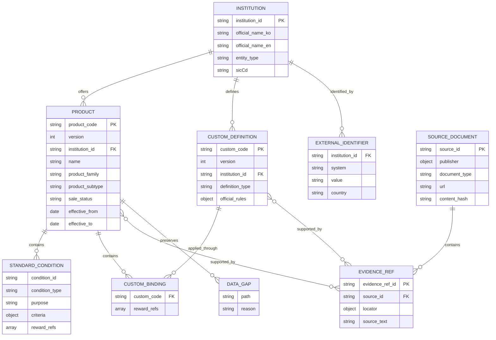
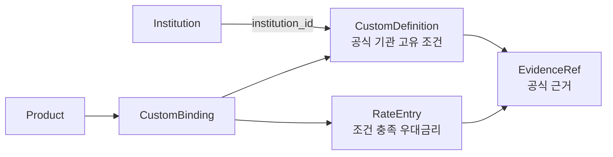

# 금융상품 데이터 관계 설계

## 설계 개요

금융상품은 금리뿐 아니라 가입 대상, 납입 한도, 우대조건, 중도해지이율 등 복합적인 조건을 가진다. 본 설계는 금융기관과 상품을 독립적인 핵심 엔터티로 관리하고, 모든 상품 조건을 공식 자료의 근거와 함께 구조화한다. 확인되지 않은 값은 추정하지 않으며, 상품 조건이 변경될 때는 기존 데이터를 덮어쓰지 않고 새 버전을 생성한다.

## 최종 데이터 관계

## 핵심 엔터티

### Institution

금융기관의 기준 정보다. `institution_id`는 ddakrate가 발급하는 중립적인 내부
식별자다. 금융위원회 고유번호, 법인등록번호, 사업자등록번호, 행정표준기관코드는
각각 별도의 ExternalIdentifier로 저장한다. 특정 외부 데이터에 기관이 없거나
외부 번호가 변경되어도 Product와 CustomDefinition의 연결은 유지된다.

### Product

적금, 예금, 파킹통장, CMA의 전체 공식 조건을 보유한다. 금리, 기간, 가입 대상, 가입 좌수, 판매 기간, 판매 한도, 납입 한도, 중도해지이율, 만기후이율과 같은 결정 가능한 정보를 구조화하며, 각 값은 공식 근거를 참조한다.

### StandardCondition

급여이체, 카드 사용, 비대면 가입, 첫 거래처럼 여러 기관에서 공통으로 나타나는 조건을 일관된 형태로 표현한다. 조건 충족 시 적용되는 우대금리는 `reward_refs`로 Product의 금리 항목과 연결한다.

### CustomDefinition과 CustomBinding

걸음 수, 기관 고유 서비스, 특정 활동 증빙처럼 공통 조건으로 정확하게 표현할 수 없는 공식 조건은 `CustomDefinition`으로 정의한다. CustomDefinition은 `institution_id`를 통해 해당 기관에 직접 귀속되며, Product는 `CustomBinding`을 통해 이를 사용한다. 하나의 기관 고유 정의를 동일 기관의 여러 상품이 재사용할 수 있다.

## 데이터 무결성 원칙

1. 모든 Product의 `institution_id`는 실제 Institution을 참조한다.
2. 모든 CustomDefinition은 `institution_id`를 통해 정의 주체인 Institution에 연결한다.
3. Product가 사용하는 CustomDefinition은 Product와 동일한 기관에 속해야 한다.
4. 우대조건의 `reward_refs`는 해당 Product에 존재하는 금리 항목을 참조한다.
5. 상품과 조건의 값은 공식 홈페이지, 공식 상품설명서 또는 공식 API의 EvidenceRef를 가진다.
6. 공식 자료에서 확인되지 않은 값은 추정하지 않고 Data Gap으로 보존한다.
7. 상품 조건이 변경되면 기존 버전을 덮어쓰지 않고 새 버전을 생성한다.
8. `effective_from`과 `effective_to`는 공식 효력일이 확인된 경우에만 기록한다.

## 설계 특징

- **안정적인 내부 기관 식별자:** 기관과 상품, 기관 고유 조건은 외부 번호와 분리된 `institution_id`로 일관되게 연결한다.
- **다중 공식 식별자:** FSS·법인·사업자·행정기관 코드를 namespace와 함께 보존하며 서로 다른 번호를 가장하거나 대체하지 않는다.
- **공통 조건의 재사용:** 반복되는 조건은 StandardCondition으로 표현해 비교와 판정을 일관되게 수행한다.
- **고유 조건의 정확한 보존:** 특이한 상품 조건도 주관적인 분류가 아니라 공식 상품 조건으로 저장한다.
- **근거 추적성:** 상품 값에서 공식 원문까지 SourceDocument와 EvidenceRef를 통해 추적할 수 있다.
- **불확실성의 명시:** 확인하지 못한 정보는 누락을 숨기거나 생성하지 않고 Data Gap으로 공개한다.
- **이력 보존:** 조건 변경 시 버전을 추가해 과거 상품 조건과 변경 이력을 보존한다.

## 구축 결과

2026-09-05 발행 `index.json` 기준 상품 4,295개를 구조화했다. 판매 중 4,289개,
판매 종료 3개, 판매중지 2개, 상태 미확인 1개다. 상품군은 적금 2,185개,
예금 1,824개, 파킹통장 218개, CMA 68개이며, 상품이 연결된 금융기관은 721개다.
기관 master snapshot은 1,704개다.

SourceDocument 9,183개와 EvidenceRef 15,430개가 연결되어 있다. 후보 발견에는
비교 서비스 목록을 사용했고, 공식 페이지·상품설명서로 재확인한 근거와
아직 재확인되지 않은 발견본·Data Gap을 구분한다. 이 규모가 전 항목의
공식 검증 완료나 기관 고유 CustomDefinition 전수 이관을 뜻하지는 않는다.
상품의 `institution_id`는 기관 master를 참조하며, 타 기관 연결은 발행
검사에서 거부한다.
