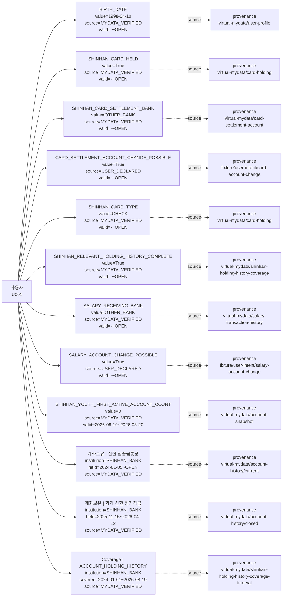
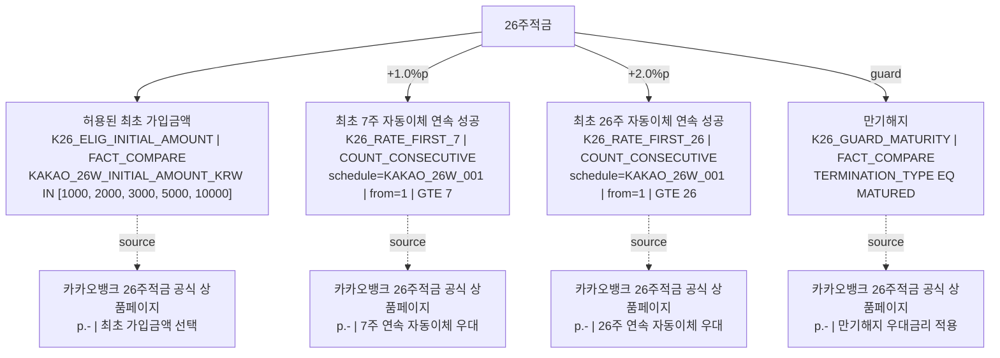

# Financial Eligibility Engine v0.2 Mermaid Demo

## Evaluation Trace — 신한 청년 처음적금

```mermaid
flowchart TD
    P["청년 처음적금<br/>advertised=6.05% | realizable=4.55%"]
    G_ELIG["가입자격"]
    P --> G_ELIG
    G_ELIG_R0{"청년 처음적금 가입자격<br/>ELIGIBILITY | AND"}
    G_ELIG --> G_ELIG_R0
    G_ELIG_R0_C0["가입연령 18~39세<br/>ELIG_AGE | DERIVED_COMPARE"]
    G_ELIG_R0 --> G_ELIG_R0_C0
    G_ELIG_R0_C0_E["Evidence<br/>actual=28<br/>expected=[18, 39]<br/>operator=BETWEEN_INCLUSIVE<br/>derivation=AGE_AT<br/>input_fact_id=F-BIRTH<br/>reference_date=2026-08-20"]
    G_ELIG_R0_C0 --> G_ELIG_R0_C0_E
    G_ELIG_R0_C0_S["SATISFIED<br/>AGE_WITHIN_ALLOWED_RANGE"]
    G_ELIG_R0_C0_E --> G_ELIG_R0_C0_S
    G_ELIG_R0_C0_PV0["PRODUCT_DOCUMENT<br/>신한은행 청년 처음적금 상품설명서"]
    G_ELIG_R0_C0 -. provenance .-> G_ELIG_R0_C0_PV0
    G_ELIG_R0_C0_PV1["MYDATA_VERIFIED<br/>F-BIRTH"]
    G_ELIG_R0_C0 -. provenance .-> G_ELIG_R0_C0_PV1
    G_ELIG_R0_C0_PV2["MYDATA_VERIFIED<br/>virtual-mydata/user-profile"]
    G_ELIG_R0_C0 -. provenance .-> G_ELIG_R0_C0_PV2
    G_ELIG_R0_C1["1인 1계좌<br/>ELIG_ONE_ACCOUNT | FACT_COMPARE"]
    G_ELIG_R0 --> G_ELIG_R0_C1
    G_ELIG_R0_C1_E["Evidence<br/>actual=0<br/>expected=0<br/>operator=EQ<br/>fact_type=SHINHAN_YOUTH_FIRST_ACTIVE_ACCOUNT_COUNT<br/>source_type=MYDATA_VERIFIED<br/>effective_at=2026-08-20<br/>fact_id=F-SAME-PRODUCT-COUNT"]
    G_ELIG_R0_C1 --> G_ELIG_R0_C1_E
    G_ELIG_R0_C1_S["SATISFIED<br/>NO_EXISTING_SAME_PRODUCT_ACCOUNT"]
    G_ELIG_R0_C1_E --> G_ELIG_R0_C1_S
    G_ELIG_R0_C1_PV0["PRODUCT_DOCUMENT<br/>신한은행 청년 처음적금 상품설명서"]
    G_ELIG_R0_C1 -. provenance .-> G_ELIG_R0_C1_PV0
    G_ELIG_R0_C1_PV1["MYDATA_VERIFIED<br/>F-SAME-PRODUCT-COUNT"]
    G_ELIG_R0_C1 -. provenance .-> G_ELIG_R0_C1_PV1
    G_ELIG_R0_C1_PV2["MYDATA_VERIFIED<br/>virtual-mydata/account-snapshot"]
    G_ELIG_R0_C1 -. provenance .-> G_ELIG_R0_C1_PV2
    G_ELIG_R0_E["Evidence<br/>declared_children=2<br/>evaluated_children=2"]
    G_ELIG_R0 --> G_ELIG_R0_E
    G_ELIG_R0_S["SATISFIED<br/>ALL_AND_CHILDREN_SATISFIED"]
    G_ELIG_R0_E --> G_ELIG_R0_S
    G_ELIG_R0_PV0["PRODUCT_DOCUMENT<br/>신한은행 청년 처음적금 상품설명서"]
    G_ELIG_R0 -. provenance .-> G_ELIG_R0_PV0
    G_ELIG_R0_PV1["MYDATA_VERIFIED<br/>F-BIRTH"]
    G_ELIG_R0 -. provenance .-> G_ELIG_R0_PV1
    G_ELIG_R0_PV2["MYDATA_VERIFIED<br/>virtual-mydata/user-profile"]
    G_ELIG_R0 -. provenance .-> G_ELIG_R0_PV2
    G_ELIG_R0_PV3["MYDATA_VERIFIED<br/>F-SAME-PRODUCT-COUNT"]
    G_ELIG_R0 -. provenance .-> G_ELIG_R0_PV3
    G_RATE["우대금리"]
    P --> G_RATE
    G_RATE_R0["주거래 우대<br/>RATE_SALARY | COUNT_DISTINCT_MONTHS"]
    G_RATE --> G_RATE_R0
    G_RATE_R0_C0["급여 수령계좌 변경 가능<br/>CAP_SALARY_ACCOUNT_CHANGE | FACT_COMPARE"]
    G_RATE_R0 --> G_RATE_R0_C0
    G_RATE_R0_C0_E["Evidence<br/>actual=True<br/>expected=True<br/>operator=EQ<br/>fact_type=SALARY_ACCOUNT_CHANGE_POSSIBLE<br/>source_type=USER_DECLARED<br/>effective_at=2026-08-19<br/>fact_id=F-SALARY-CHANGE"]
    G_RATE_R0_C0 --> G_RATE_R0_C0_E
    G_RATE_R0_C0_S["SATISFIED<br/>SALARY_ACCOUNT_CAN_BE_CHANGED"]
    G_RATE_R0_C0_E --> G_RATE_R0_C0_S
    G_RATE_R0_C0_PV0["USER_DECLARED<br/>F-SALARY-CHANGE"]
    G_RATE_R0_C0 -. provenance .-> G_RATE_R0_C0_PV0
    G_RATE_R0_C0_PV1["USER_DECLARED<br/>fixture/user-intent/salary-account-change"]
    G_RATE_R0_C0 -. provenance .-> G_RATE_R0_C0_PV1
    G_RATE_R0_E["Evidence<br/>operator=GTE<br/>current=0<br/>required=6<br/>fact_type=SHINHAN_QUALIFYING_SALARY_MONTH<br/>available_future_months=[&quot;2026-08&quot;, &quot;2026-09&quot;, &quot;2026-10&quot;, &quot;2026-11&quot;, &quot;2026-12&quot;, &quot;2027-01&quot;, &quot;202…<br/>available_future_periods=[&quot;2026-08&quot;, &quot;2026-09&quot;, &quot;2026-10&quot;, &quot;2026-11&quot;, &quot;2026-12&quot;, &quot;2027-01&quot;, &quot;202…<br/>capability_status=SATISFIED"]
    G_RATE_R0 --> G_RATE_R0_E
    G_RATE_R0_S["ACHIEVABLE<br/>SALARY_MONTHS_CAN_BE_COMPLETED"]
    G_RATE_R0_E --> G_RATE_R0_S
    G_RATE_R0_PV0["PRODUCT_DOCUMENT<br/>신한은행 청년 처음적금 상품설명서"]
    G_RATE_R0 -. provenance .-> G_RATE_R0_PV0
    G_RATE_R0_PV1["USER_DECLARED<br/>F-SALARY-CHANGE"]
    G_RATE_R0 -. provenance .-> G_RATE_R0_PV1
    G_RATE_R0_PV2["USER_DECLARED<br/>fixture/user-intent/salary-account-change"]
    G_RATE_R0 -. provenance .-> G_RATE_R0_PV2
    G_RATE_R1["신한카드 결제 우대<br/>RATE_CARD | COUNT_DISTINCT_MONTHS"]
    G_RATE --> G_RATE_R1
    G_RATE_R1_C0{"신한카드 결제계좌 변경 가능<br/>CAP_SHINHAN_CARD_SETTLEMENT | AND"}
    G_RATE_R1 --> G_RATE_R1_C0
    G_RATE_R1_C0_C0["신한카드 보유<br/>CAP_SHINHAN_CARD_HELD | FACT_COMPARE"]
    G_RATE_R1_C0 --> G_RATE_R1_C0_C0
    G_RATE_R1_C0_C0_E["Evidence<br/>actual=True<br/>expected=True<br/>operator=EQ<br/>fact_type=SHINHAN_CARD_HELD<br/>source_type=MYDATA_VERIFIED<br/>effective_at=2026-08-19<br/>fact_id=F-CARD-HELD"]
    G_RATE_R1_C0_C0 --> G_RATE_R1_C0_C0_E
    G_RATE_R1_C0_C0_S["SATISFIED<br/>SHINHAN_CARD_ALREADY_HELD"]
    G_RATE_R1_C0_C0_E --> G_RATE_R1_C0_C0_S
    G_RATE_R1_C0_C0_PV0["MYDATA_VERIFIED<br/>F-CARD-HELD"]
    G_RATE_R1_C0_C0 -. provenance .-> G_RATE_R1_C0_C0_PV0
    G_RATE_R1_C0_C0_PV1["MYDATA_VERIFIED<br/>virtual-mydata/card-holding"]
    G_RATE_R1_C0_C0 -. provenance .-> G_RATE_R1_C0_C0_PV1
    G_RATE_R1_C0_C1["결제계좌 변경 가능<br/>CAP_CARD_SETTLEMENT_CHANGE | FACT_COMPARE"]
    G_RATE_R1_C0 --> G_RATE_R1_C0_C1
    G_RATE_R1_C0_C1_E["Evidence<br/>actual=True<br/>expected=True<br/>operator=EQ<br/>fact_type=CARD_SETTLEMENT_ACCOUNT_CHANGE_POSSIBLE<br/>source_type=USER_DECLARED<br/>effective_at=2026-08-19<br/>fact_id=F-CARD-SETTLEMENT-CHANGE"]
    G_RATE_R1_C0_C1 --> G_RATE_R1_C0_C1_E
    G_RATE_R1_C0_C1_S["SATISFIED<br/>CARD_SETTLEMENT_ACCOUNT_CAN_BE_CHANGED"]
    G_RATE_R1_C0_C1_E --> G_RATE_R1_C0_C1_S
    G_RATE_R1_C0_C1_PV0["USER_DECLARED<br/>F-CARD-SETTLEMENT-CHANGE"]
    G_RATE_R1_C0_C1 -. provenance .-> G_RATE_R1_C0_C1_PV0
    G_RATE_R1_C0_C1_PV1["USER_DECLARED<br/>fixture/user-intent/card-account-change"]
    G_RATE_R1_C0_C1 -. provenance .-> G_RATE_R1_C0_C1_PV1
    G_RATE_R1_C0_E["Evidence<br/>declared_children=2<br/>evaluated_children=2"]
    G_RATE_R1_C0 --> G_RATE_R1_C0_E
    G_RATE_R1_C0_S["SATISFIED<br/>ALL_AND_CHILDREN_SATISFIED"]
    G_RATE_R1_C0_E --> G_RATE_R1_C0_S
    G_RATE_R1_C0_PV0["MYDATA_VERIFIED<br/>F-CARD-HELD"]
    G_RATE_R1_C0 -. provenance .-> G_RATE_R1_C0_PV0
    G_RATE_R1_C0_PV1["MYDATA_VERIFIED<br/>virtual-mydata/card-holding"]
    G_RATE_R1_C0 -. provenance .-> G_RATE_R1_C0_PV1
    G_RATE_R1_C0_PV2["USER_DECLARED<br/>F-CARD-SETTLEMENT-CHANGE"]
    G_RATE_R1_C0 -. provenance .-> G_RATE_R1_C0_PV2
    G_RATE_R1_C0_PV3["USER_DECLARED<br/>fixture/user-intent/card-account-change"]
    G_RATE_R1_C0 -. provenance .-> G_RATE_R1_C0_PV3
    G_RATE_R1_E["Evidence<br/>operator=GTE<br/>current=0<br/>required=6<br/>fact_type=SHINHAN_CARD_QUALIFYING_MONTH<br/>available_future_months=[&quot;2026-08&quot;, &quot;2026-09&quot;, &quot;2026-10&quot;, &quot;2026-11&quot;, &quot;2026-12&quot;, &quot;2027-01&quot;, &quot;202…<br/>available_future_periods=[&quot;2026-08&quot;, &quot;2026-09&quot;, &quot;2026-10&quot;, &quot;2026-11&quot;, &quot;2026-12&quot;, &quot;2027-01&quot;, &quot;202…<br/>capability_status=SATISFIED"]
    G_RATE_R1 --> G_RATE_R1_E
    G_RATE_R1_S["ACHIEVABLE<br/>CARD_MONTHS_CAN_BE_COMPLETED"]
    G_RATE_R1_E --> G_RATE_R1_S
    G_RATE_R1_PV0["PRODUCT_DOCUMENT<br/>신한은행 청년 처음적금 상품설명서"]
    G_RATE_R1 -. provenance .-> G_RATE_R1_PV0
    G_RATE_R1_PV1["MYDATA_VERIFIED<br/>F-CARD-HELD"]
    G_RATE_R1 -. provenance .-> G_RATE_R1_PV1
    G_RATE_R1_PV2["MYDATA_VERIFIED<br/>virtual-mydata/card-holding"]
    G_RATE_R1 -. provenance .-> G_RATE_R1_PV2
    G_RATE_R1_PV3["USER_DECLARED<br/>F-CARD-SETTLEMENT-CHANGE"]
    G_RATE_R1 -. provenance .-> G_RATE_R1_PV3
    G_RATE_R2["신한 슈퍼SOL 우대<br/>RATE_SUPERSOL | FACT_COMPARE"]
    G_RATE --> G_RATE_R2
    G_RATE_R2_E["Evidence<br/>expected=True<br/>operator=EQ<br/>fact_type=SUPER_SOL_JOIN_LOGIN_MAINTAIN_WILLING<br/>effective_at=2026-08-19"]
    G_RATE_R2 --> G_RATE_R2_E
    G_RATE_R2_S["UNKNOWN<br/>SUPER_SOL_INTENT_UNRESOLVED"]
    G_RATE_R2_E --> G_RATE_R2_S
    G_RATE_R2_PV0["PRODUCT_DOCUMENT<br/>신한은행 청년 처음적금 상품설명서"]
    G_RATE_R2 -. provenance .-> G_RATE_R2_PV0
    G_RATE_R3{"첫거래 또는 이벤트 우대<br/>RATE_FIRST_OR_EVENT | OR"}
    G_RATE --> G_RATE_R3
    G_RATE_R3_C0["첫거래 branch<br/>RATE_FIRST_TRANSACTION_BRANCH | NOT_EXISTS"]
    G_RATE_R3 --> G_RATE_R3_C0
    G_RATE_R3_C0_E["Evidence<br/>holding_from=2025-11-15<br/>holding_to=2026-04-12<br/>lookback_from=2025-08-20<br/>lookback_to=2026-08-19<br/>overlap=True<br/>matched_count=1<br/>entity=ACCOUNT_HOLDING_INTERVAL"]
    G_RATE_R3_C0 --> G_RATE_R3_C0_E
    G_RATE_R3_C0_S["UNSATISFIABLE<br/>PRIOR_HOLDING_OVERLAPS_LOOKBACK"]
    G_RATE_R3_C0_E --> G_RATE_R3_C0_S
    G_RATE_R3_C0_PV0["PRODUCT_DOCUMENT<br/>신한은행 청년 처음적금 상품설명서"]
    G_RATE_R3_C0 -. provenance .-> G_RATE_R3_C0_PV0
    G_RATE_R3_C0_PV1["MYDATA_VERIFIED<br/>A-SHINHAN-SAVINGS-OLD"]
    G_RATE_R3_C0 -. provenance .-> G_RATE_R3_C0_PV1
    G_RATE_R3_C0_PV2["MYDATA_VERIFIED<br/>virtual-mydata/account-history/closed"]
    G_RATE_R3_C0 -. provenance .-> G_RATE_R3_C0_PV2
    G_RATE_R3_C1["이벤트 branch<br/>RATE_EVENT_BRANCH | FACT_COMPARE"]
    G_RATE_R3 --> G_RATE_R3_C1
    G_RATE_R3_C1_E["Evidence<br/>expected=True<br/>operator=EQ<br/>fact_type=SPECIAL_RATE_COUPON_VALID<br/>effective_at=2026-08-19"]
    G_RATE_R3_C1 --> G_RATE_R3_C1_E
    G_RATE_R3_C1_S["UNKNOWN<br/>EVENT_COUPON_STATUS_UNRESOLVED"]
    G_RATE_R3_C1_E --> G_RATE_R3_C1_S
    G_RATE_R3_C1_PV0["PRODUCT_DOCUMENT<br/>신한은행 청년 처음적금 상품설명서"]
    G_RATE_R3_C1 -. provenance .-> G_RATE_R3_C1_PV0
    G_RATE_R3_E["Evidence<br/>declared_children=2<br/>evaluated_children=2"]
    G_RATE_R3 --> G_RATE_R3_E
    G_RATE_R3_S["UNKNOWN<br/>OR_CHILD_UNKNOWN"]
    G_RATE_R3_E --> G_RATE_R3_S
    G_RATE_R3_PV0["PRODUCT_DOCUMENT<br/>신한은행 청년 처음적금 상품설명서"]
    G_RATE_R3 -. provenance .-> G_RATE_R3_PV0
    G_RATE_R3_PV1["MYDATA_VERIFIED<br/>A-SHINHAN-SAVINGS-OLD"]
    G_RATE_R3 -. provenance .-> G_RATE_R3_PV1
    G_RATE_R3_PV2["MYDATA_VERIFIED<br/>virtual-mydata/account-history/closed"]
    G_RATE_R3 -. provenance .-> G_RATE_R3_PV2
    G_GUARD["Global Guard"]
    P --> G_GUARD
    G_GUARD_R0["만기해지 guard<br/>GUARD_MATURITY | FACT_COMPARE"]
    G_GUARD --> G_GUARD_R0
    G_GUARD_R0_E["Evidence<br/>expected=MATURED<br/>operator=EQ<br/>fact_type=TERMINATION_TYPE<br/>effective_at=2027-08-20"]
    G_GUARD_R0 --> G_GUARD_R0_E
    G_GUARD_R0_S["ACHIEVABLE<br/>MATURITY_GUARD_PENDING"]
    G_GUARD_R0_E --> G_GUARD_R0_S
    G_GUARD_R0_PV0["PRODUCT_DOCUMENT<br/>신한은행 청년 처음적금 상품설명서"]
    G_GUARD_R0 -. provenance .-> G_GUARD_R0_PV0
```

## User Fact Map — U001

```mermaid
flowchart LR
    U["사용자\nU001"]
    F0["BIRTH_DATE<br/>value=1998-04-10<br/>source=MYDATA_VERIFIED<br/>valid=-~OPEN"]
    U --> F0
    FPV0_0["provenance<br/>virtual-mydata/user-profile"]
    F0 -. source .-> FPV0_0
    F1["SHINHAN_CARD_HELD<br/>value=True<br/>source=MYDATA_VERIFIED<br/>valid=-~OPEN"]
    U --> F1
    FPV1_0["provenance<br/>virtual-mydata/card-holding"]
    F1 -. source .-> FPV1_0
    F2["SHINHAN_CARD_SETTLEMENT_BANK<br/>value=OTHER_BANK<br/>source=MYDATA_VERIFIED<br/>valid=-~OPEN"]
    U --> F2
    FPV2_0["provenance<br/>virtual-mydata/card-settlement-account"]
    F2 -. source .-> FPV2_0
    F3["CARD_SETTLEMENT_ACCOUNT_CHANGE_POSSIBLE<br/>value=True<br/>source=USER_DECLARED<br/>valid=-~OPEN"]
    U --> F3
    FPV3_0["provenance<br/>fixture/user-intent/card-account-change"]
    F3 -. source .-> FPV3_0
    F4["SHINHAN_CARD_TYPE<br/>value=CHECK<br/>source=MYDATA_VERIFIED<br/>valid=-~OPEN"]
    U --> F4
    FPV4_0["provenance<br/>virtual-mydata/card-holding"]
    F4 -. source .-> FPV4_0
    F5["SHINHAN_RELEVANT_HOLDING_HISTORY_COMPLETE<br/>value=True<br/>source=MYDATA_VERIFIED<br/>valid=-~OPEN"]
    U --> F5
    FPV5_0["provenance<br/>virtual-mydata/shinhan-holding-history-coverage"]
    F5 -. source .-> FPV5_0
    F6["SALARY_RECEIVING_BANK<br/>value=OTHER_BANK<br/>source=MYDATA_VERIFIED<br/>valid=-~OPEN"]
    U --> F6
    FPV6_0["provenance<br/>virtual-mydata/salary-transaction-history"]
    F6 -. source .-> FPV6_0
    F7["SALARY_ACCOUNT_CHANGE_POSSIBLE<br/>value=True<br/>source=USER_DECLARED<br/>valid=-~OPEN"]
    U --> F7
    FPV7_0["provenance<br/>fixture/user-intent/salary-account-change"]
    F7 -. source .-> FPV7_0
    F8["SHINHAN_YOUTH_FIRST_ACTIVE_ACCOUNT_COUNT<br/>value=0<br/>source=MYDATA_VERIFIED<br/>valid=2026-08-19~2026-08-20"]
    U --> F8
    FPV8_0["provenance<br/>virtual-mydata/account-snapshot"]
    F8 -. source .-> FPV8_0
    A0["계좌보유 | 신한 입출금통장<br/>institution=SHINHAN_BANK<br/>held=2024-01-05~OPEN<br/>source=MYDATA_VERIFIED"]
    U --> A0
    APV0_0["provenance<br/>virtual-mydata/account-history/current"]
    A0 -. source .-> APV0_0
    A1["계좌보유 | 과거 신한 정기적금<br/>institution=SHINHAN_BANK<br/>held=2025-11-15~2026-04-12<br/>source=MYDATA_VERIFIED"]
    U --> A1
    APV1_0["provenance<br/>virtual-mydata/account-history/closed"]
    A1 -. source .-> APV1_0
    COV0["Coverage | ACCOUNT_HOLDING_HISTORY<br/>institution=SHINHAN_BANK<br/>covered=2024-01-01~2026-08-19<br/>source=MYDATA_VERIFIED"]
    U --> COV0
    COVPV0_0["provenance<br/>virtual-mydata/shinhan-holding-history-coverage-interval"]
    COV0 -. source .-> COVPV0_0
```

## Product Rule Graph — 카카오뱅크 26주적금

```mermaid
flowchart TD
    P["26주적금"]
    ELIG["허용된 최초 가입금액<br/>K26_ELIG_INITIAL_AMOUNT | FACT_COMPARE<br/>KAKAO_26W_INITIAL_AMOUNT_KRW IN [1000, 2000, 3000, 5000, 10000]"]
    P --> ELIG
    ELIG_SRC["카카오뱅크 26주적금 공식 상품페이지<br/>p.- | 최초 가입금액 선택"]
    ELIG -. source .-> ELIG_SRC
    RATE0["최초 7주 자동이체 연속 성공<br/>K26_RATE_FIRST_7 | COUNT_CONSECUTIVE<br/>schedule=KAKAO_26W_001 | from=1 | GTE 7"]
    P -->|+1.0%p| RATE0
    RATE0_SRC["카카오뱅크 26주적금 공식 상품페이지<br/>p.- | 7주 연속 자동이체 우대"]
    RATE0 -. source .-> RATE0_SRC
    RATE1["최초 26주 자동이체 연속 성공<br/>K26_RATE_FIRST_26 | COUNT_CONSECUTIVE<br/>schedule=KAKAO_26W_001 | from=1 | GTE 26"]
    P -->|+2.0%p| RATE1
    RATE1_SRC["카카오뱅크 26주적금 공식 상품페이지<br/>p.- | 26주 연속 자동이체 우대"]
    RATE1 -. source .-> RATE1_SRC
    GUARD0["만기해지<br/>K26_GUARD_MATURITY | FACT_COMPARE<br/>TERMINATION_TYPE EQ MATURED"]
    P -->|guard| GUARD0
    GUARD0_SRC["카카오뱅크 26주적금 공식 상품페이지<br/>p.- | 만기해지 우대금리 적용"]
    GUARD0 -. source .-> GUARD0_SRC
```
